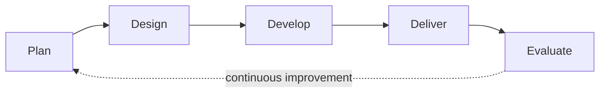
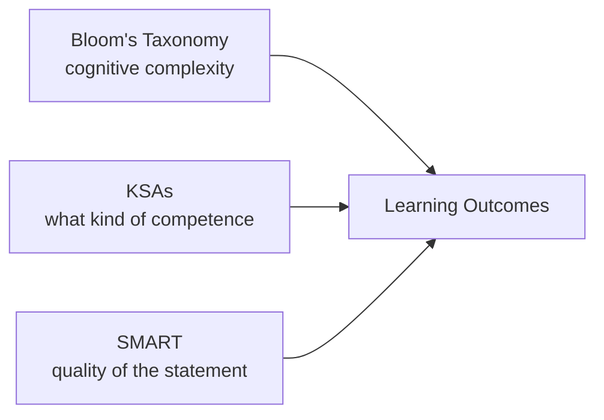
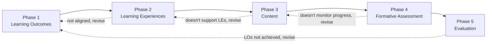

# Session 1 - Principles of learning - how they apply to training and teaching

## Presentation

Here you can find the presentation for this session:

<iframe src="https://docs.google.com/presentation/d/1ziXD-n2Q6ihKPGTkIp66X8RVqcjLCr0E/preview" width="640" height="360" allow="autoplay"></iframe>

The full presentation can be downloaded <a href="https://docs.google.com/presentation/d/1h_7aIcUhMIIpW5_-qMhX8vwh3mQ0LY4x/edit?usp=share_link&ouid=117857355916723671329&rtpof=true&sd=true">[here]</a>.

## Session 2 - Part I - Introduction and Learning Outcomes

### Welcome and roadmap

Session 2 moves from theory into practice: designing and delivering an actual mini-training. By the end of this session, participants will have planned, designed, developed, delivered, and evaluated a short training module of their own.

The session follows five phases, in order:

1. **Plan** a mini-training - define the target audience, define Learning Outcomes.
2. **Design** a mini-training - differentiate a Syllabus from a lesson plan, write the basics of a Syllabus, draw a concept map to define content.
3. **Develop** a mini-training - write a lesson plan.
4. **Deliver** a mini-training - prepare and present a small lecture.
5. **Evaluate** the mini-training - continuous improvement.

!!! tip "For trainers running this session"
    This roadmap is worth stating explicitly at the very start (it's given almost word-for-word twice in the source slides - once as a warm-up, once alongside the formal Learning Outcomes) - participants benefit from hearing where the session is headed before diving in.

### Learning Outcomes for Session 2

By the end of this session, you will be able to:

- **Plan** a mini-training: define the target audience; define [Learning Outcomes](glossary.md#glossary-learning-outcomes).
- **Design** a mini-training: differentiate a Syllabus and a lesson plan; write the basics of a Syllabus; draw a concept map to define content.
- **Develop** a mini-training: write a lesson plan.
- **Deliver** a mini-training: prepare and present a small lecture.
- **Evaluate** your mini-training: continuous improvement.

---

### Challenge - How do you currently plan and design a training session?

!!! question "Challenge - How do you currently plan and design a training session or course? (5 min, individual)"
    Review the list of potential actions for planning and designing a training session (below). Reflect on your own practice:

    - Which actions do you already use?
    - What order do you follow?

    Write your approach in the shared doc.

The list of potential actions to reflect on:

- **Plan learning activities** - lecture, work in groups, flipped class.
- **Define prerequisites** - reflect on needed prior knowledge and skills; define session prerequisites.
- **Develop content and materials** - identify session topics; create slides; prepare tutorials/exercises.
- **Identify target audience** - who is my target audience? What are its training needs?
- **Define Learning Outcomes** - reflect on what learners will be able to do by the end of the session; write the LOs.
- **Create formative assessment** - reflect on how to assess learners' progress and how to collect and give feedback; create materials accordingly.
- **Plan final evaluation** - reflect on how you will evaluate learner achievement; prepare a final test.
- **Define Teaching Goals** - reflect on your own goals and intentions as an instructor.

!!! tip "For trainers running this session"
    There's no single right order for this list - the point of the reflection is to surface that everyone already does *some* of this, often implicitly, and that the rest of the session will give it a more deliberate structure.

### The training life cycle

This session is built around a simplified version of the training life cycle developed by the ELIXIR training platform.[^1]

- **Plan** - assess training needs; define Learning Outcomes as a form of retro-planning (starting from the destination and working backward).
- **Design** - put together the Syllabus, lesson plan, and Learning Experiences.
- **Develop** - create the tangible materials needed to achieve the Learning Outcomes.
- **Deliver** - ensure an effective and inclusive course.
- **Evaluate** - continuously improve the training experience.

!!! tip "For trainers running this session"
    This is a deliberately simplified picture. The full training life cycle covers more ground (finding suitable trainers, logistics, budget) than this session addresses - Session 2 focuses specifically on Plan, Design, Develop, Deliver, and Evaluate as they apply to building one mini-training.

---

## Session 2 - Part II - Learning Outcomes: Three Frameworks

### Challenge - What are Learning Outcomes?

!!! question "Challenge - What are Learning Outcomes? (2 min, individual)"
    In your own words, write in the shared doc what you think a Learning Outcome is.

!!! tip "For trainers running this session"
    Follow with a 3-minute group discussion before revealing the formal answer below - let participants compare their own definitions first.

### Three frameworks toward good Learning Outcomes

There's more than one way to think about what makes a Learning Outcome effective, but three frameworks - used together - make your LOs sharper and more useful, both as a planning tool for you and as a guide for learners' expectations and progress.

**[Bloom's Taxonomy](glossary.md#glossary-blooms-taxonomy)** - already introduced in Session 1: the six levels of cognitive complexity (Remember, Understand, Apply, Analyze, Evaluate, Create), each paired with observable action verbs.

**The KSA framework** - specifies which kind of competence learners will demonstrate:

- **Knowledge** - theoretical and practical understanding.
- **Skills** - practical application of that knowledge.
- **Abilities** - the capacity to actually perform a task.

For example: does a learner need to understand programming logic (Knowledge)? Use Python (Skill)? Solve a novel problem with it (Ability)? Each is a different competence, and naming which one you're targeting changes what a good Learning Outcome looks like.[^2]

**The SMART framework** - defines what's expected of learners in a way that's genuinely usable:

- **Specific** - unambiguous.
- **Measurable** - progress can be tracked.
- **Achievable** - a real challenge, but within reach (an unreachable goal demotivates rather than stretches).
- **Relevant** - aligned with the learner's educational or professional goals.
- **Time-bound** - a clear timeline.

!!! tip "For trainers running this session"
    Recommended further reading on writing outcomes: the Stanford Center for Teaching and Learning's guide to crafting learning outcomes.[^3]

### Putting it together: what is a Learning Outcome?

A **[Learning Outcome](glossary.md#glossary-learning-outcomes)** is a statement expressing what learners will be able to demonstrate after a lesson. That statement matters for three different audiences at once: it helps *you* design the learning experience, it tells *learners* what they're working toward, and it lets *other trainers* reuse your material with a clear sense of what it achieves.

- Should be **SMART**.
- Should express which **KSAs** are being targeted.
- Can benefit from **Bloom's** action verbs to make it specific and assessable.

### Why the verb matters: the DNA sequencing example

Consider this Learning Outcome: *"By the end of the course, learners will know the DNA sequencing process."*

At first glance this seems fine - but the verb **"know"** is vague and hard to assess. What does "knowing" actually look like? Can the learner describe the process? Apply it? Analyze or evaluate it? If you don't specify what learners should be able to *do* with the knowledge, you risk designing assessments that are either too broad or not meaningful.

Bloom's action verbs solve this: instead of "know," you might ask whether learners can **describe**, **explain**, **demonstrate**, **illustrate**, or **apply** the process. A revised version: *"By the end of the course, learners will be able to describe the steps of the DNA sequencing process."* Now you can genuinely assess understanding - through written explanations, diagrams, or presentations.

### Teaching Goal vs. Learning Outcome, revisited

Recall the distinction from Session 1: **[Teaching Goals](glossary.md#glossary-teaching-goals)** describe what *you* intend to teach; **Learning Outcomes** describe what *learners* will be able to do. Having a clear Teaching Goal upfront makes it much easier to write clear LOs.

A worked example:

- **Teaching Goal:** How the PCR cycles enable DNA replication.
- **Learning Outcomes:**
    - Describe each step of the PCR.
    - Explain the function of each step in the cycle.

A few more side-by-side examples of "what you plan to teach" (Teaching Goal framing) versus "what learners will be able to do" (LO framing):

- How the PCR cycles enable DNA replication, *or* how to perform the key steps to run a PCR?
- Tying a bow tie in 3 minutes, *or* finding the best guiding video in 3 minutes so you can tie one yourself?
- Methods to improve their training session, *or* how to create engaging presentations?

### Writing Learning Outcomes using action verbs

- Use a verb that describes an **observable action**.
- You can take a general approach ("learners will be able to...") or a personal approach ("you will be able to...") - both work, depending on your audience and tone.
- Avoid verbs open to multiple interpretations (know, understand, appreciate) - these are difficult to measure and lead to vague assessments. Prefer verbs like define, analyze, compare, or construct, which are grounded in Bloom's taxonomy.

---

### Reflecting on this: completing a Learning Outcome

This is a good moment for trainers to ask learners to reflect informally - not yet a formal Challenge (that comes next, in the Syllabus Challenge) - on completing this sentence, choosing a Bloom's-level verb deliberately:

*By the end of this course, learners will be able to __________.*

(Or, in the personal framing: *You will be able to __________.*)

Use the Bloom's verb table below as a reference:

| Level | Example verbs |
|---|---|
| Remember | Define, describe, list, recognize, connect, affirm, write, measure, identify |
| Understand | Compare, classify, discuss, distinguish, explain, exemplify, interpret, express, predict |
| Apply | Apply, change, choose, demonstrate, calculate, verify, explain how, predict, solve, construct, experiment, write |
| Analyze | Analyze, order, compare, conclude, criticize, diagnose, connect, distinguish, examine, justify, deduce |
| Evaluate | Evaluate, decide, determine, correct, advise, choose, compare, conclude, criticize, defend, judge, justify, quantify, synthesize |
| Create | Discuss, conclude, create, develop, formulate, generalize, generate, integrate, modify, plan, propose, design, invent |

!!! tip "For trainers running this session"
    Reference: [tips.uark.edu/using-blooms-taxonomy](https://tips.uark.edu/using-blooms-taxonomy/) for the fuller verb list. Keep this table visible - learners will use it again shortly, for real, when they draft their Syllabus.

---

## Session 2 - Part III - Syllabus and Learning Experiences

### Where does the Syllabus actually belong?

The Syllabus sits at the boundary between **Plan** and **Design** - it isn't purely one or the other. Some of what goes into a Syllabus (the target audience, the Learning Outcomes) comes directly out of the Plan phase; the rest of it - actually structuring that into a syllabus document - is Design work. So it's fair to think of the Syllabus as belonging to both phases at once, or as sitting right in the transition between them.

### A Syllabus vs. a lesson plan

A Syllabus and a lesson plan differ fundamentally in scope, purpose, flexibility, and who they're for:

| | Syllabus | Lesson plan |
|---|---|---|
| **Scope** | The entire course or subject across a term, outlining all topics and objectives | One single lesson or class session within the broader syllabus |
| **Audience** | Student-facing - course expectations, assessment methods, policies | Instructor-facing - a tactical guide for daily activities and pedagogy |
| **Flexibility** | Relatively fixed - macro-level structure and stability | Dynamic and adaptable to real-time classroom needs |
| **Content detail** | Summarizes LOs, topics, grading, and required materials for the whole course | Details specific objectives, procedures, materials, timing, and assessment for one lesson |
| **Ownership** | Typically created by departments or boards, aligned with curriculum standards | Developed by individual trainers based on classroom context |

Together, a Syllabus scaffolds long-term learning while a lesson plan delivers effective daily instruction - they're complementary, not competing, documents.

---

### Challenge - Draft a Syllabus

!!! question "Challenge - Draft a Syllabus (12 min, individual)"
    Choose a topic for a 3-minute lesson - something you could actually teach someone in three minutes.

    - Draft the content idea (a short description - don't spend time preparing the actual content yet).
    - Define the target audience.
    - Describe the prerequisites.
    - Write 2-3 Learning Outcomes, using Bloom's taxonomy and action verbs.

    Write your draft in the shared doc. Two or three LOs is more than enough for a 3-minute lesson.

!!! tip "For trainers running this session"
    This mini-training topic and Syllabus draft is the seed participants will keep building on for the rest of the session - the concept map, lesson plan, and delivery all come back to this same 3-minute topic.

### Learning Experiences

A **[Learning Experience (LE)](glossary.md#glossary-learning-experience)** is what a student actually does that supports learning and achieving a Learning Outcome. Some examples of genuinely varied LEs:

- Pipette coloured water into a small tube to simulate an experimental procedure.
- Work in groups to write an essay comparing two teaching methodologies.
- Taste three different types of cheese to describe and compare their flavour profiles.
- Read a classroom scenario and propose three practical strategies to increase learner engagement.
- Watch a five-minute video to gain contextual background on the topic.
- Taste four coffee brewing methods to distinguish and compare their flavour profiles.

The critical question at this stage of design is always: **are the Learning Experiences aligned with the Learning Outcomes?** If your LO requires learners to *create* something (a high Bloom's level), a lecture alone won't get them there - you need an LE that actually lets them create, like a hands-on exercise or a project.

If a Learning Experience doesn't align with its Learning Outcome, you have two options: revise the Learning Experience, or revise the Learning Outcome itself. Neither is a failure - it's exactly how this kind of design is supposed to work.

---

### Challenge - Add Learning Experiences to your Syllabus

!!! question "Challenge - Add Learning Experiences to your Syllabus (6 min, individual)"
    For each Learning Outcome in your Syllabus draft, think through possible Learning Experiences that would be aligned with it. Choose one Learning Experience per LO, and add it to your Syllabus in the shared doc.

---

## Session 2 - Part IV - Backward Instructional Design

### Why design backward?

Traditional course design often starts with "what content should I cover?" - and plans lectures to deliver that content. **[Backward Instructional Design](glossary.md#glossary-backward-design)** flips this entirely: it starts with the destination (what learners will be able to do) and works backward to figure out how to get there. It applies at any scale, from a 3-minute mini-training to an entire curriculum.

The backward design process, in order:

1. **Start with the end in mind** - define clear Learning Outcomes, including their cognitive level.
2. **Plan Learning Experiences** - design activities that will actually get learners to those outcomes.
3. **Determine necessary content** - identify what content is needed to support those activities.
4. **Plan formative assessment** - design ways to monitor learning progress *during* instruction, not just at the end.
5. **Evaluate achievement** - determine how you'll assess whether learners actually reached the outcomes.

Traditional, content-first design tends to fail in predictable ways: it focuses on what the instructor will *do* rather than what the learner will *achieve*; it assumes covering content is the same as learning it; it produces passive, lecture-centred experiences; and it often leaves learners asking "why do I need to know this?"

Backward design succeeds because every activity, piece of content, and assessment directly supports a defined Learning Outcome - a property sometimes called **constructive alignment**. It promotes active learning (since you're designing from "what must learners do"), makes learning purposeful, enables genuinely meaningful assessment, increases efficiency (no content that doesn't serve an LO), and better supports transfer to real-world use.

### Nicholls' Five Phases of Curriculum Design

Backward design has a well-established structure: Nicholls' five-phase model.[^4]

**Phase 1 - Learning Outcomes.** Everything starts here - LOs are the destination. If you don't know where you're going, you can't choose the right vehicle, plan the route, or know when you've arrived. LOs must be SMART. Ask: *are my Learning Outcomes clear and measurable? Can learners actually achieve them in the time available?*

**Phase 2 - Learning Experiences.** Select or develop the experiences that will get learners to those outcomes. Ask: *are the Learning Experiences aligned with the Learning Outcomes?* If not aligned, revise the LEs (try again) or revise the LOs (go back to Phase 1).

**Phase 3 - Content.** Only now do we ask "what content do I need?" - content serves the Learning Experiences and Outcomes, not the other way around. Ask: *does the content support the Learning Experiences and promote achievement of the Learning Outcomes?* Content should be focused and relevant, appropriate for learners' cognitive level, and just sufficient to support the planned activities - not exhaustive.

**Phase 4 - Formative Assessment.** Ongoing feedback and evaluation *during* the learning process, not just at the end - ideally every 15-20 minutes in a training session. Ask: *do assessments support learners' progress toward the Learning Outcomes?* Examples: quick exercises, reflection activities, diagnostic questions, or the "3-2-1" technique (3 things learned, 2 things to explore further, 1 remaining question).

**Phase 5 - Evaluation.** The overall effectiveness of the course. Ask: *can learners achieve the Learning Outcomes? Is the course successful?* A useful comprehensive framework here is **[Kirkpatrick-Katzell's four levels](glossary.md#glossary-kirkpatrick-katzell)**: Reaction (how did learners feel?), Learning (what did they actually learn?), Behavior (are they applying it?), Results (what impact does this have?).

!!! tip "For trainers running this session"
    The arrows matter as much as the boxes. This model is deliberately iterative, not a straight line: discovering that your content doesn't support your Learning Experiences means going back and adjusting, not starting over from scratch. That's refinement, not failure - and each iteration makes the course more effective.

**A practical summary to leave participants with:** start by writing SMART Learning Outcomes; don't think about content yet - think about what activities will get learners there; only then select the minimum content needed; design frequent formative assessment; plan how you'll evaluate overall success; and be ready to iterate based on what you discover at each phase. Learning Outcomes are the north star - every decision should be justified by asking "does this help learners achieve the intended outcomes?"

[^1]: ELIXIR Training Platform, [ELIXIR-Training-SPLASH](https://elixir-europe-training.github.io/ELIXIR-Training-SPLASH/).
[^2]: TeachFloor, [Knowledge, Skills, Abilities (KSA)](https://www.teachfloor.com/elearning-glossary/knowledge-skills-abilities-ksa).
[^3]: Stanford Center for Teaching and Learning, [Crafting Learning Outcomes](https://irds.stanford.edu/sites/g/files/sbiybj10071/f/clo.pdf).
[^4]: Nicholls, G. (2002). *Developing Teaching and Learning in Higher Education.* Routledge, pp. 51-75. As presented in: Via, A., Palagi, P.M., Lindvall, J.M., et al. (2020). Course design: Considerations for trainers - a Professional Guide. *F1000Research*, 9:1377. doi: 10.7490/f1000research.1118395.1.

---

## Session 2 - Part V - Concept Maps and Content Reduction

### What is a concept map?

A **[concept map](glossary.md#glossary-concept-map)** is a graphical strategy for organizing and representing knowledge. It combines *concepts* (usually shown as boxes or circles) with *relationships* (shown as connecting lines and linking phrases) between them. Invented by Joseph D. Novak in 1972, the method is grounded in meaningful-learning theory - it encourages learners (and trainers) to connect new information to what they already know.[^5]

Concept maps are useful for structuring content logically, identifying gaps in your own understanding of a topic, and facilitating discussion and collaboration.

### Creating a concept map

Concept maps are built from **nodes** (key terms or concepts) and **edges** (the relationships between them, often carrying a linking phrase like "leads to," "requires," or "is part of"). Start with a focus question or context to give the map direction - for example, "what are the key steps and concepts involved in DNA sequencing?" A first draft doesn't need to be perfect; concept maps are generated through iteration and feedback.

!!! tip "For trainers running this session"
    The source slides illustrate this with a detailed worked example mapping out different coffee-brewing methods and their flavour profiles - a genuinely rich example of nodes and edges in action, but the original author's own notes flag it as a placeholder ("replace the example with one more closely related to training and training plans"). Treat it as provisional: useful for showing the mechanics of nodes and edges today, but a strong candidate to swap for a training-design-specific example (e.g. mapping out backward design itself) when this handbook is next revised.

### Using concept maps for content reduction

One of the hardest challenges in course design is **content reduction** - the natural, well-intentioned urge to share everything you know. With limited contact time, the temptation is to pack in as much as possible. Effective design requires the opposite, counterintuitive principle: **less is more**.

Why content overload actually backfires:

- **Working memory becomes overwhelmed.** Learners can only hold about 4-7 chunks of information at once (recall [cognitive load](glossary.md#glossary-cognitive-load) from Session 1) - excessive content simply exceeds this capacity.
- **Mental models fragment.** Instead of an integrated understanding, learners end up with incomplete or incorrect [mental models](glossary.md#glossary-mental-model), remembering isolated facts without seeing how they connect.
- **Transfer to long-term memory fails.** Moving information into [long-term memory](glossary.md#glossary-long-term-memory) needs time to process, practice, and connect - content overload doesn't leave room for that consolidation.
- **The [expert blind spot](glossary.md#glossary-expert-blind-spot) makes it worse.** As experts, we've automated foundational skills, see connections instantly that novices can't, and underestimate how long "obvious" things take to learn. Failing to reduce content means teaching at expert pace to novices.
- **It demotivates learners.** Overload creates a sense of inadequacy ("everyone else gets this, but I don't"), which can lead to disengagement or drop-out.

Concept maps are a genuinely practical tool for reducing content, not just organizing it:

- They force you to explicitly identify **core concepts** (the well-connected nodes) versus **peripheral concepts** (the ones with few connections) - the latter are candidates for removal.
- They reveal the **learning path**: which concepts are prerequisite to others, and what's the minimum viable path through the material.
- A simplified concept map can even be shared with learners, to help them see the big picture and where to focus attention.

**A practical technique: the "parking lot."** Map out everything you initially think should be included. Identify the key points that directly support your Learning Outcomes. Everything else goes into a "parking lot" - interesting, related, but not essential material, kept as optional extension content for learners who move faster or want to go deeper. This satisfies the expert's urge to share comprehensive knowledge without overloading everyone else.

Content reduction isn't about covering less ground for its own sake - it's about learning more deeply. Every minute spent on unnecessary content is a minute not spent processing, practicing, and consolidating what actually matters. As always, the content you keep should be calibrated to where your actual learners are starting from, not where you are as an expert.

!!! tip "For trainers running this session"
    A useful mindset shift to leave participants with: from "what can I teach?" to "what must learners be able to do?"; from "how much can I cover?" to "how deeply can learners learn?" Practical guideline: start with your Learning Outcomes, map your topic, identify the critical path, cut anything that doesn't directly support an LO, test your timing, and prepare extension material separately.

---

### Challenge - Draw a concept map for your mini-lesson

!!! question "Challenge - Draw a Concept Map for your mini-lesson (15 min, individual)"
    Create a concept map for your 3-minute training topic:

    - Begin with a focus question - one that your concept map will answer.
    - Identify 5-9 key concepts learners need to understand to answer that question.
    - Map the relationships between them, using labeled connecting lines (e.g. "leads to," "requires," "includes").
    - Add cross-links between concepts in different areas of your map where they genuinely relate.
    - Arrange it hierarchically - the most general concepts at the top, more specific ones below.

    Share a screenshot of your map in the shared doc, with your name.

---

## Session 2 - Part VI - Giving and Receiving Feedback

A short but important detour before the next Challenge, since it involves pairing up to give each other feedback on your concept maps.

### Feedback is information meant for improvement

Effective feedback focuses on specific behaviors or outcomes, is timely and relevant, encourages reflection and self-correction, and supports continuous improvement. As trainers, the goal is to create a safe space where feedback is welcomed as a tool for growth, not experienced as criticism.

Feedback should be **constructive** - specific, respectful, and focused on improvement, not just on pointing out what went wrong. It should guide the learner toward what they can do better next time, sparking genuine reflection rather than defensiveness. Before giving feedback, it's worth asking yourself: is it clear and actionable? Does it encourage growth? Is it delivered in a way that motivates rather than discourages?

When *receiving* feedback, the goal is to stay open and curious - ask questions, reflect on what you've heard, and treat it as a stepping stone rather than a verdict. Feedback works best as a dialogue, not a judgment.

### How to give feedback well

- Listen actively and attentively before responding.
- Do not interrupt one another.
- Challenge one another, but do so respectfully.
- Critique ideas, not people.
- Speak from your own experience, without generalizing (use "I noticed..." or "I felt..." rather than assumptions about others).
- Take responsibility for the quality of the discussion.

### How to receive feedback well

- Ask for clarification if you're confused.
- Build on one another's comments; work toward shared understanding.
- Do not monopolize the discussion.
- Do not offer opinions without supporting evidence.
- If you're offended by anything said, acknowledge it immediately rather than letting it sit.

---

### Challenge - Share your concept map

!!! question "Challenge - Share the Concept Map (6 min, pairs)"
    Pair up (breakout rooms). Exchange concept maps - show which one is yours, without explaining it.

    Each of you writes in the shared doc:

    - One thing you're confused about, or not sure about, in your partner's map.
    - One thing you like, or that is clear, about your partner's map.

!!! tip "For trainers running this session"
    Follow with about 5 minutes of open sharing time before moving on.

---

## Session 2 - Part VII - Developing Content and the Lesson Plan

### How do you start developing content?

There's no single right starting point - these approaches combine well:

- **Start from your own knowledge.** Your expertise is a valuable foundation - outline what you already know first.
- **Look for reference material.** Books, articles, trusted websites, and existing training resources (e.g. [TeSS, the ELIXIR Training e-Support System](https://tess.elixir-europe.org/)) enrich and validate your content.
- **Make a slide presentation.** Visualizing ideas early helps structure the flow and surface gaps.
- **Discuss with other specialists.** Collaboration brings new perspectives and improves accuracy.
- **Write the content for reference** (e.g. a Markdown file or Word document) - a durable resource you can refine and reuse.

Recall from Nicholls' Phase 3: content should be focused and relevant (not trying to cover everything), appropriate for the learners' cognitive level, and just sufficient to support the planned Learning Experiences - not exhaustive.

Once you have a concept map, developing content becomes more concrete:

- Look back at your concept map and brainstorm an **ordered list of topics** - this becomes the backbone of your training.
- Each node needs content development: slides, text, activities, or a combination.
- Keep your target audience in mind throughout - their expected needs, prior knowledge, and capabilities.
- Connect everything back to your lesson plan, so content, activities, and outcomes stay coherent.

### Basics of a lesson plan

A **[lesson plan](glossary.md#glossary-lesson-plan)** is your roadmap for delivering a structured, effective learning experience - it keeps you organized, focused, and aligned with your Learning Outcomes. Shared with learners, it also gives them transparency: a guide for self-study, tracking progress, and self-assessment.

A lesson plan is a time distribution of a lesson, supporting the content dimension and organized for reproducibility. A worked example schedule for a longer session:

| Time | Segment |
|---|---|
| 10 min | Introduction |
| 30 min | Lecture |
| 15 min | Activity |
| 15 min | Coffee break |
| 45 min | Lecture |
| 10 min | Activity |
| 10 min | Discussion |
| 1 hour | Lunch |

!!! tip "For trainers running this session"
    The "less is more" principle from content reduction applies directly here. Overloading a schedule with back-to-back content risks the same fragmented mental models and demotivation discussed above - and it's easy to fall into the expert-gap trap of moving too fast. Reduce content to the key points, and keep some spare material ready in case a particular group has more background and can move faster.

For each segment of your lesson plan, define:

- **Time** - how long the activity takes.
- **Teaching Goal / purpose** - the instructional objective for that segment.
- **Learning Outcome** - what learners will be able to do by the end of the activity.
- **Activity (Learning Experience)** - what learners will actually do.
- **Description** - a detailed description of the activity.
- **Materials** - links to slides, PDFs, shared docs, videos, etc.

| Time | Activity (LEs) | Description | Materials | LOs | Teaching goal |
|---|---|---|---|---|---|
| ... | Introduction | Tour of the table, everyone introduces themselves | Game (e.g. Kahoot) | | |
| ... | Ice breaker | Each person shares what tea they'd be, and why | | | |
| ... | Lecture | Explaining the core concept | Slides | | |
| ... | Group work | Groups of 3 work through a task together | Shared docs | | |
| ... | Group discussion | Each group shares their thoughts | | | |

---

### Challenge - Produce the content for your mini-training

!!! question "Challenge - Produce the content and training material for your mini-lesson (15 min, individual)"
    It's time to prepare the actual content of your mini-training. Suggested structure:

    - 20 seconds - introduction
    - 2 minutes 20 seconds - on topic
    - 20 seconds - conclusion

    Use your concept map as support. Ask yourself: do you need any material support? Recall from Session 1:

    - [Dual coding](glossary.md#glossary-chunking)
    - Concrete examples
    - [Chunking](glossary.md#glossary-chunking)
    - Avoiding [cognitive load](glossary.md#glossary-cognitive-load)

---

## Session 2 - Part VIII - Delivering and Evaluating the Mini-Training

### Challenge - Deliver your mini-training

!!! question "Challenge - Deliver mini-training (~20 min, groups)"
    Each participant has 3 minutes to deliver their session.

    **During delivery:**

    - The trainer delivers the session.
    - Learners take notes for real-time feedback.

    **During feedback time:**

    - The trainer shares a self-assessment (their own feedback on their delivery first).
    - Learners then provide feedback: one good thing, and one thing to improve.

    Useful criteria to keep in mind while observing: Learning Outcomes, Learning Experiences, Teaching Goal, and whether the timing actually fit.

!!! tip "For trainers running this session"
    Follow with about 5 minutes of open sharing time before moving to the Evaluate phase.

### Reflecting to improve: the first step of evaluation

Learning Outcomes should map cleanly to Learning Experiences, and both should map back to the course or session's aim and title: **title -> aim -> Learning Outcomes -> Learning Experiences**, each one flowing logically from the one before it.

Two recap diagrams from earlier in the session are worth revisiting at this point, now that you've actually been through the full cycle once:

- **[Backward instructional design](glossary.md#glossary-backward-design), in five steps:** select Learning Outcomes; select Learning Experiences to achieve them; select content based on the LOs; identify or develop assessments to track progress toward the LOs; self-evaluate the effectiveness of your Learning Experiences in actually leading learners to the LOs.
- **[Nicholls' cycle](#part-iv-backward-instructional-design)**, revisited: the same five phases, with the same core question at each step - does this element support the previous one, and promote the Learning Outcomes? If a proposition to move forward is denied at any phase, that's the model doing its job: it's telling you where to go back and revise.

---

### Challenge - Self-reflect on your initial Learning Outcomes

!!! question "Challenge - Self-reflect on your initial LOs (2 min, individual)"
    Based on the delivery of your mini-training session, look back at the Learning Outcomes you set at the very start:

    - Were learners actually able to achieve the LOs you set?
    - Did your training session lead learners to achieve them?

[^5]: Novak, J.D. & Canas, A.J. *The Theory Underlying Concept Maps and How to Construct and Use Them.* Florida Institute for Human and Machine Cognition.

---

## Session 2 - Summary and Key Takeaways

Session 2 turned the theory from Session 1 into a repeatable design process, walked end-to-end through one full mini-training: planning it, designing it, developing its content, delivering it, and evaluating it.

**The thread running through all five phases is backward design:** start from Learning Outcomes, not content. Select Learning Experiences aligned with those outcomes. Only then figure out what content is actually needed - and keep it lean, since content reduction protects learners from the same cognitive overload covered in Session 1. Build in formative assessment throughout, not just a final test. And treat evaluation as the start of the next iteration, not an ending.

Three frameworks - **Bloom's Taxonomy**, **KSAs**, and **SMART** - work together to make a Learning Outcome genuinely usable, both for you as a design tool and for learners as a guide to what's expected of them. And two practical tools carry the design process forward: the **concept map**, for organizing and reducing content, and the **lesson plan**, for turning a designed course into something deliverable, minute by minute.

Feedback - both giving and receiving it well - turned out to be a practical skill in its own right, not just a nice-to-have, since so much of this session's own learning happened through peers reviewing each other's concept maps and mini-training deliveries.

Before moving to Session 3, take a moment to think about:

- One thing you understood and feel you can already put into practice.
- One thing you're not sure of, and would want more clarification on.

