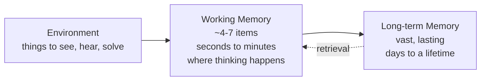
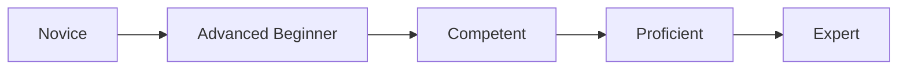
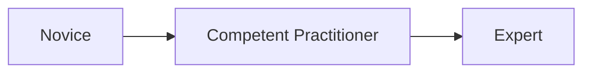
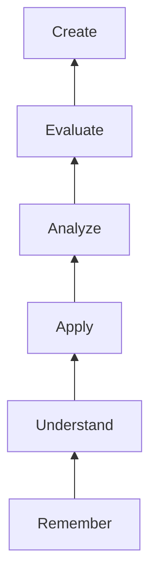

      This session is under construction. The reference material can be found <a href="https://docs.google.com/presentation/d/1ziXD-n2Q6ihKPGTkIp66X8RVqcjLCr0E/edit?usp=sharing&ouid=117857355916723671329&rtpof=true&sd=true">[here....]</a>      

# Session 1 - Principles of learning - how they apply to training and teaching

## Lesson overview

!!! overview ""

    :fontawesome-regular-bookmark: **Description**

    Session 1 reviews the principles of learning and explores how these fundamental concepts apply directly to effective training and teaching practices.

    :fontawesome-solid-arrow-left: **Prerequisites**

    This session is designed for those with little or no teaching experience. An interest and enthusiasm for teaching is all that is required.

    :fontawesome-solid-arrow-right: **Learning Outcomes**

    By the end of this session, learners will be able to:

    1. List at least two different types of learning.
    2. Describe the key features of several learning models and principles.
    3. Explain why understanding how learning works is important for classroom practice.

    :fontawesome-solid-users: **Target Audience**

    Anyone involved in training.

    :fontawesome-solid-stairs: **Level**

    Beginner

    :fontawesome-solid-lock: **License**

    [Creative Commons Attribution 4.0 International License](https://creativecommons.org/licenses/by/4.0/)

    :fontawesome-solid-money-bill-1: **Funding**

    This project has received funding from ELIXIR-EXCELERATE, ELIXIR-STEERS and the ELIXIR Training Platform.

[comment]: # (Property in Bioschemas: description)
[comment]: # (Property in Bioschemas: coursePrequsites)
[comment]: # (Property in Bioschemas: teaches)
[comment]: # (Property in Bioschemas: audience)
[comment]: # (Property in Bioschemas: educationalLevel)
[comment]: # (Property in Biochemas: licence)

## Presentation

Here you can find the presentation for this session:

<iframe src="https://docs.google.com/presentation/d/1ziXD-n2Q6ihKPGTkIp66X8RVqcjLCr0E/preview" width="640" height="360" allow="autoplay"></iframe>

The full presentation can be downloaded <a href="https://docs.google.com/presentation/d/1h_7aIcUhMIIpW5_-qMhX8vwh3mQ0LY4x/edit?usp=share_link&ouid=117857355916723671329&rtpof=true&sd=true">[here]</a>.

## Session 1 - Part I - Introduction and Learning Outcomes

### Why this session matters

Session 1 is a bit different from Sessions 2, 3, and 4: it's more theoretical. Instead of a specific training technique, it tackles a foundational question - **why should trainers care about how learning actually works?**

Here's the dilemma most trainers run into: academic research on learning tends to be dense and hard to translate into practice, while practical "how to teach" guides are easy to follow but rarely explain *why* their tips work. That gap leaves trainers making instructional decisions on gut feeling alone.

This session aims to close that gap. Understanding the principles behind learning gives you more than a bag of tricks - it gives you a way of thinking that lets you:

- diagnose why a learning activity isn't landing,
- adapt your approach to a new context or audience,
- and make deliberate, informed choices about how you design and run a course.

That's the real difference between a good trainer and a truly effective one: not just delivering content, but engineering conditions where genuine, lasting learning happens.

!!! tip "For trainers running this session"
    Warn learners up front that this session is dense. It covers a lot of theory in a short time, which can be demanding to sit through. A short heads-up ("bear with us, this one's more intense") goes a long way toward keeping the group with you.

---

### Challenge - How do you learn something new?

Before introducing any theory, get learners to reflect on their own experience. This grounds everything that follows in something concrete rather than abstract.

!!! question "Challenge - How do you learn something new? (3 min individual + 3 min discussion)"
    Recall a time you learned something new - baking, driving, a mathematical theorem, a piece of music, anything. How did you go about it?

    Use sticky notes or the [Google Form](https://forms.gle/HYWGWJMutfREeYdk9) to capture your answer, then we'll discuss a few examples together.

**Facilitation notes:** once responses come in, look for the different *types* of learning hiding in them. Learning can be, for example:

- something that stays in memory (facts, information),
- something that builds understanding (grasping a concept or idea),
- something that becomes a skill (e.g. writing),
- something that lets you solve new kinds of problems,
- something that becomes automatic (e.g. driving),
- something that changes who you are (e.g. going from student to teacher),
- something that shapes a decision (e.g. choosing between treatments),
- or something that changes a behaviour (e.g. quitting a habit).

Use the discussion to make two points, in this order:

1. **The best approach depends on the type of learning.** Practising a skill works well if you want to *do* something; rehearsal works well if you want to memorise a poem. There's no one-size-fits-all method.
2. **One thing all these examples have in common is [permanence](glossary.md#glossary-permanence).** Whatever the type of learning, it isn't real learning unless it lasts. Flag this now - it's the bridge into the next part of the session, where the group builds a working definition of "learning" together.

Also worth naming explicitly: **learning is something learners do.** It isn't something a trainer does *to* them.

---

### Learning Outcomes for Session 1

By the end of this session, participants will be able to:

1. **List** at least two different types of learning (e.g. mnemonic and practical).
2. **Describe** the key features of a few learning models, principles, and strategies.
3. **Explain** why understanding learning - and the models and principles behind it - matters for classroom practice.

!!! tip "For trainers running this session"
    Walk through these three outcomes and briefly explain each. For outcome 1, you can point back to the [Challenge - How do you learn something new?](#challenge-how-you-learn) itself as the example: the activity where learners reflected on different types of learning *was* the teaching practice chosen to achieve that outcome.

#### A quick word on Learning Outcomes vs. Teaching Objectives

Learning Outcomes are at the heart of every [ELIXIR-GOBLET Train-the-Trainer (TtT)](glossary.md#glossary-ttt) session - and we'd argue they should be at the heart of any course, university semester or short intensive workshop, whatever the topic or audience.

The distinction that matters here:

- **[Learning Outcomes (LOs)](glossary.md#glossary-learning-outcomes)** are *learner-centric*: they describe the knowledge, skills, and abilities a learner should be able to demonstrate once instruction is complete - the tangible evidence that something was actually achieved.
- **[Teaching Goals (TGs)](glossary.md#glossary-teaching-goals)**, sometimes called teaching objectives, are *instructor-centric*: they describe the trainer's intentions - the actions, environment, or process the trainer sets up to help learners reach those outcomes.

("Instruction," in this context, just means any unit of learning: a single lesson, a full session, an entire course, or even a semester-long module.)

If the difference feels subtle right now, that's completely normal - it'll come up again several times over the course, and it gets easier to spot with practice.

---

## Session 1 - Part II - How Learning Works: Fundamental Concepts

### Challenge - How would you define "learning"?

Before handing learners a definition, get them to build one themselves. It makes whatever definition comes next land as a refinement of their own thinking, rather than as a fact dropped from above.

!!! question "Challenge - How would you define \"learning\"? (5 min in pairs + 3 min discussion)"
    How would *you* define "learning"?

    Work in pairs. Use sticky notes or the shared doc to write down your definition.

!!! tip "For trainers running this session"
    Read out a few of the definitions learners came up with, and comment on them. Use what they say as your way in to the next three ideas: permanence as a defining feature of learning, a proposed working definition, and the more detailed definition from Ambrose et al. - all covered below.

---

### Permanence: the one thing every kind of learning shares

Whatever a learner produced in the [Challenge - How would you define "learning"?](#challenge-define-learning), there's a good chance "permanence" shows up somewhere in it, even if not by that name. It's worth naming explicitly: **a change only counts as learning if it lasts.**

A couple of examples make this concrete:

- **A one-time access code vs. a PIN.** You can hold a text-message code in your head just long enough to type it in - and then it's gone. That's not learning. Your bank card PIN, on the other hand, you retain indefinitely. That *is* learning.
- **Learning vocabulary in a new language.** Reading a word list with the book open, and repeating it back, feels like progress - but it isn't learning yet. It's part of the process. The moment you can use that word correctly in a sentence, a week later, without the book, that's when learning has actually happened.

### A working definition of learning

Putting that together, here's a useful working definition:

> Learning is a relatively permanent change in behaviour, skills, knowledge, or attitudes, resulting from identifiable psychological or social experiences.[^1]

A closely related, more detailed version of the same idea:

> Learning is the process through which individuals (or systems) acquire knowledge, skills, behaviours, or attitudes through experience, study, or instruction. It involves the assimilation and processing of information, leading to changes in understanding, capability, or performance that are relatively permanent.

Both definitions are pointing at the same thing: permanence, plus a change in something - knowledge, behaviour, skill, or attitude.

### Three key features of learning (Ambrose et al.)

Ambrose and colleagues, in *How Learning Works* - first published in 2010 as *Seven Research-Based Principles for Smart Teaching*, then substantially updated in 2023 as *Eight Research-Based Principles for Smart Teaching* - break learning down into three features that are worth discussing one at a time - ideally with at least one concrete example per feature.[^2]

#### 1. Learning is a process, not a product

Learning happens inside someone's head, which means we can never observe it directly - only infer that it happened, from what someone produces or does afterward.

*Example: building a birdhouse.* If you set students the task of building a wooden birdhouse, the finished birdhouse isn't really the point. The learning is in the process: measuring, cutting, getting it wrong, noticing the misalignment, adjusting, and getting better at using the tools. A good assessment looks at *that* process and the skills built along the way - not just whether the birdhouse stands up.

#### 2. Learning involves change

The change has to be real and it has to unfold over time - in what someone knows, believes, does, or how they feel about something. It's not a passing reaction; it reshapes how they think and act going forward.

*Example: a unit on climate change.* A student starts out believing their individual choices don't matter. Over the course of some interactive lessons, that shifts across several dimensions at once:

- **Knowledge** - they now understand the science behind greenhouse gases.
- **Belief** - they now think their actions *can* make a difference.
- **Behaviour** - they start recycling and biking to school instead of driving.
- **Attitude** - they develop a real sense of responsibility for the environment.

#### 3. Learning is something students do - not something done to them

Learning is the outcome of how learners interpret and respond to their own experiences, interactions, and effort. A trainer can create the right conditions for that to happen, but can't do the learning on someone else's behalf.

*Example: a student-led experiment.* Instead of lecturing about plant growth, a teacher lets students design their own experiment - choosing variables like light or soil type, forming a hypothesis, and tracking results over several weeks. The learning happens because the students are the ones making decisions, taking ownership, and reflecting on what they find. The teacher's role is to guide and supply resources, not to supply the learning itself.

!!! tip "For trainers running this session"
    Try to have at least one example ready for each of the three features above before you run this part of the session - it's much easier for a group to grasp "learning is a process, not a product" through a birdhouse or bicycle than through the abstract phrase alone.

---

### Challenge - Why does this matter for you as an instructor?

!!! question "Challenge - Why is learning about learning relevant for an instructor? (5 min in pairs + 3 min discussion)"
    Why is *learning about learning* relevant to you as a trainer?

!!! tip "For trainers running this session"
    A few points worth bringing into the discussion, if they don't come up naturally:

    - Every trainer has run into the same recurring frustrations: learners who can't apply what they were taught, who cling to misconceptions, who look disengaged despite genuinely interesting content, who overestimate how well they understood something, or who keep using study strategies that don't actually work. These aren't separate, unrelated problems - they're all symptoms of how learning actually works, and understanding that mechanism is what lets you address the *cause* rather than firefighting the symptoms one at a time.
    - It's easy to confuse *our effort* (the teaching) with *what learners take away* (the learning) - but those are genuinely different things, and mixing them up quietly shapes how we teach without us noticing.
    - Try this thought experiment with the group: if a cognitive scientist convinced you that people retain almost nothing after 20 minutes of passively listening, would you keep lecturing for 45? And how would your teaching change if you assumed, instead, that a learner's mind is something to be gradually filled rather than actively engaged?
    - Most trainers know, in the abstract, that "what I taught" and "what they learned" aren't the same thing - but in practice, it's very easy to slip into assuming they are.

---

[^1]: Adapted from Seifert, K. & Sutton, R., *Educational Psychology* (Lumen Learning course).
[^2]: Ambrose, S.A., Bridges, M.W., DiPietro, M., Lovett, M.C., & Norman, M.K. (2010). *How Learning Works: Seven Research-Based Principles for Smart Teaching.* Jossey-Bass. Updated as: Lovett, M.C., Bridges, M.W., DiPietro, M., Ambrose, S.A., & Norman, M.K. (2023). *How Learning Works: Eight Research-Based Principles for Smart Teaching* (2nd ed.). Jossey-Bass.

---

## Session 1 - Part III - Landscape of Learning Theories

### So many theories - where do we even start?

A **learning theory** is a broad framework that tries to explain *how* learning happens - the underlying mechanisms behind acquiring knowledge, skills, attitudes, and behaviours. Researchers in cognitive science and educational psychology have proposed a huge number of them over the last century or so; if you go looking, you'll find dozens of schools of thought, each with its own vocabulary and its own take on what matters most.

That raises an obvious question: which one should we rely on? Which should we learn, teach, and apply?

**The honest answer is: none of them, exclusively.** There is no single "universal theory of learning" that describes, with the rigor of a law of physics, exactly how learning works. Different theories each capture something real and useful - but no one theory captures everything.

!!! tip "For trainers running this session"
    Be upfront that this session can't be exhaustive, and that a deep dive into individual learning theories is beyond its scope. If learners are curious to go further, *Learning Theories Simplified* by Bob Bates is a good next step: it covers 130 classic and contemporary theorists in an accessible, bite-sized format, each with a practical "how to use it" section.

Given that landscape, this course takes a deliberately narrower, more practical path: rather than surveying theories, we focus on a small number of **learning models** and **evidence-based principles and strategies** - the parts of the research that translate most directly into things you can actually do differently in a classroom.

---

### Theory, model, principle, strategy - what's the difference?

These four words get used loosely and interchangeably in everyday conversation, but they mean different things, and it's worth being precise about them once, here, so they don't cause confusion later in the course.

- **[Learning theory](glossary.md#glossary-learning-theory)** - a broad, explanatory framework for *why and how* learning occurs in general.
- **[Learning model](glossary.md#glossary-learning-model)** - a more specific, actionable framework that translates a theory's insights into a structure you can actually apply when designing or delivering instruction.
- **[Evidence-based principle](glossary.md#glossary-evidence-based-principle)** - a research-backed guideline that crystallises one specific, well-supported aspect of how students learn.
- **[Learning strategy](glossary.md#glossary-learning-strategy)** - a concrete, deliberate technique a learner or trainer can use to make learning more effective.

A useful analogy: if a learning theory is the *blueprint* that explains the underlying principles, a learning model is the *step-by-step instructions* for actually building something from that blueprint.

Learning models are useful for two reasons:

1. **Structure and consistency** - they give you a roadmap for designing instruction systematically, rather than improvising each time.
2. **Practical guidance** - they help you pick strategies and methods suited to your specific learners and context.

A few well-known examples of learning models: **Bloom's Taxonomy** (a hierarchical model for categorising learning outcomes), the **5E Model** (Engage, Explore, Explain, Elaborate, Evaluate - rooted in constructivist thinking), and the **Direct Instruction Model** (rooted in behaviourism, focused on clear, structured teaching).

---

### Evidence-based principles: the "why" behind the advice

Alongside theories and models, a third source of insight comes from **evidence-based principles**: guidelines distilled directly from rigorous research in education, psychology, neuroscience, and related fields - practices shown, across many studies, to reliably improve learning outcomes.

These principles exist because trainers keep running into the same handful of frustrating, recurring questions:

- Why can't students apply what they've learned?
- Why do they cling so tightly to misconceptions?
- Why aren't they more engaged by material *I* find genuinely interesting?
- Why do they think they know more than they actually do?
- Why do they keep using study strategies that don't work?

Researchers who set out to answer exactly these questions (Ambrose et al., and later Lovett et al.) distilled their findings into a set of principles - seven in the first edition, expanded to eight in the second, with the later edition digging further into the social, emotional, and cultural dimensions of learning. These principles have turned out to generalise remarkably well: they hold up across disciplines, institution types, student populations, and cultures.[^1]

Knowing these principles helps a trainer do three things:

1. Understand *why* a particular teaching approach is or isn't working.
2. Refine or invent new approaches suited to a specific context.
3. Transfer what works from one course or audience to another.

**A worked example of a principle:** *students' prior knowledge can help or hinder learning.* Every learner arrives with a mix of facts, beliefs, and assumptions from earlier courses and life experience - some accurate and useful, some not. That prior knowledge shapes how they filter and interpret everything you tell them. Research backs this up concretely: in one study, students given unfamiliar facts about *well-known* people retained twice as much as students given the same number of facts about people they'd never heard of - simply because they had something relevant to connect the new facts to.

**And a worked example of a strategy that follows from it:** giving concrete examples that connect to learners' real lives, or spacing practice out over time instead of cramming it all in at once.

We'll come back to a fuller set of these principles and strategies later in the session - this is just a first taste of what "evidence-based" actually looks like in practice.

!!! tip "For trainers running this session"
    A few further-reading pointers, if learners want to go deeper after the course:

    - Ambrose et al., *How Learning Works: Seven Research-Based Principles for Smart Teaching* - the origin of the principles referenced throughout this session.
    - Lovett, Bridges, DiPietro, Ambrose & Norman, *How Learning Works: Eight Research-Based Principles for Smart Teaching* (2nd edition) - the expanded, updated version.
    - Weinstein & Sumeracki, *Understanding How We Learn* - six strategies for effective learning, also available as a website and blog.
    - The Carpentries Instructor Training materials.

---

### The three models this session focuses on

Of everything that's out there, we've picked out **three learning models** that are especially useful for everyday classroom practice - useful precisely because they help explain *why* some teaching practices work and others quietly don't:

1. **Working memory and long-term memory** - how the mind actually processes and stores what you teach.
2. **The Dreyfus model of skill acquisition** - how learners progress from novice to expert.
3. **Bloom's Taxonomy** - how to think about the cognitive complexity of what you're asking learners to do.

The rest of Session 1 walks through each of these three in turn, and connects each one back to concrete implications for how you design and deliver instruction.

[^1]: Ambrose, S.A., Bridges, M.W., DiPietro, M., Lovett, M.C., & Norman, M.K. (2010). *How Learning Works: Seven Research-Based Principles for Smart Teaching.* Jossey-Bass. Expanded in Lovett, M.C., Bridges, M.W., DiPietro, M., Ambrose, S.A., & Norman, M.K. (2023). *How Learning Works: Eight Research-Based Principles for Smart Teaching* (2nd ed.). Jossey-Bass.

---

## Session 1 - Part IV - Eight Evidence-Based Principles of Learning

These eight principles come from the 2023 edition of *How Learning Works* (Lovett, Bridges, DiPietro, Ambrose & Norman) - an update to the original seven-principle edition (Ambrose et al., 2010) that added a new principle on student diversity and dug further into the social and emotional dimensions of learning.[^1]

Knowing these principles helps a trainer do three things: understand *why* a teaching approach is or isn't working, refine or invent approaches suited to a specific context, and transfer what works from one course or audience to another.

---

### P1 - Students differ from each other on multiple dimensions

Learners differ in identity, stage of development, and personal history - age, gender, race, sexuality, socioeconomic status, ability, religious belief, and more. None of this amounts to a learning disability, but it does measurably shape how each learner experiences the world, and in turn how they learn and perform.

Two things follow from this:

- **It affects belonging.** A learner who's been stereotyped may spend energy managing that, rather than learning. Learners from different cultural backgrounds may communicate differently in ways that affect whether their contributions get recognised.
- **It affects readiness for challenge.** A learner's developmental level - their autonomy, confidence, and sense that they can handle a challenge - shapes how much they can take on. Too little challenge and they disengage; too much and they're overwhelmed. Good instruction calibrates challenge to where the learner actually is - and that "where" shifts over time, so it isn't a one-off assessment.

!!! tip "For trainers running this session"
    The starting question for good teaching is simply: *who are my students?* You don't need to know everyone's personal background - but you should actively avoid assuming everyone shares yours. Approaching this with curiosity and flexibility signals to learners that they belong in the room.

---

### P2 - Students' prior knowledge can help or hinder learning

No learner arrives as a blank slate. Everyone brings a mix of facts, beliefs, and assumptions from earlier courses and everyday life - and that mix shapes how they filter and interpret everything new you tell them.

When that prior knowledge is accurate and gets activated at the right moment, it's a strong foundation to build on. When it's incomplete, inaccurate, or simply not relevant to the current context, it can actively distort or block new learning. Prior knowledge that's flatly wrong is usually called a [misconception](glossary.md#glossary-misconception), and misconceptions come in a few different flavours, roughly in order of how hard they are to fix:

- **Simple factual errors** - the easiest to correct.
- **Broken models** - a flawed mental structure, best surfaced by having learners reason through examples until they hit a contradiction.
- **Fundamental beliefs** - tied to a learner's identity or worldview, and by far the hardest to shift.

!!! tip "For trainers running this session"
    A few concrete ways to work with this:

    - Give learners a way to self-assess their prior knowledge before the course even starts (a short self-test works well).
    - Come prepared with material for the misconceptions you already know tend to show up in your subject area.
    - To surface broken models specifically, you need both feedback on learner progress and insight into their actual mental model - formative assessment is what gets you both. Misconceptions are best managed through a practice -> feedback -> more practice cycle, rather than a single correction.
    - Formative assessment and feedback are covered in depth in their own dedicated session of the ELIXIR-GOBLET Train-the-Trainer (TtT) course, "Assessment and feedback in training and teaching" - this is just a first taste of why they matter.

---

### P3 - How students organise knowledge influences how they learn and apply it

Learners naturally form connections between pieces of knowledge. When those connections are accurate and meaningfully structured, learners can retrieve and apply what they know effectively. When the connections are inaccurate or arbitrary, they struggle to retrieve or apply it appropriately - even if the underlying facts are correct.

This is one of the clearest differences between novices and experts: novices tend to organise what they know around individual experiences or stories, while experts organise knowledge hierarchically, fitting new pieces into a larger structure and noticing when something doesn't fit. This isn't a fixed trait - knowledge organisation develops over time, and instructors can actively help it along.

!!! tip "For trainers running this session"
    Since learners won't necessarily organise information the way you do, look for ways to make structure visible and explicit - rather than assuming it'll form on its own.

---

### P4 - Students' motivation determines, directs, and sustains what they do to learn

Especially once learners have real autonomy over their own effort, motivation becomes central: it shapes the direction, intensity, and persistence of what they actually do. Learners tend to be strongly motivated when they see real value in a goal or activity, believe they can actually achieve it, and feel supported by their environment.

!!! tip "For trainers running this session"
    A few concrete levers for motivation:

    - Show your own enthusiasm for the material - it's more contagious than it might seem.
    - Use examples and cases that connect to learners' actual lives, jobs, or research.
    - Write clear, well-described Learning Outcomes up front, so learners know what they're working toward and don't end up frustrated after the fact.
    - Assess learners' expectations before you start.
    - Build in genuine opportunities for success, and follow up with learners after the training ends.

---

### P5 - To develop mastery, students must acquire component skills, practice integrating them, and know when to apply them

Mastery isn't just knowing the pieces - it's being able to combine them and recognise *when* a given skill or piece of knowledge actually applies. This is also where trainers can trip themselves up: once you're an expert, it's easy to fall into the [expert blind spot](glossary.md#glossary-expert-blind-spot) - losing sight of the gaps and needs a novice actually has, because the component skills feel too obvious to mention.

!!! tip "For trainers running this session"
    A few concrete levers for mastery:

    - Again, clear, well-described Learning Outcomes matter here too - they anchor what "integrating the skills" actually looks like.
    - Build in active learning: give learners many varied opportunities to practise the concepts, not just one.
    - Where possible, assign a complex project that requires combining skills, rather than only practising them in isolation.

---

### P6 - Goal-directed practice coupled with targeted feedback enhances the quality of students' learning

Practice works best when it's aimed at a specific goal or criterion, pitched at an appropriately challenging level, and repeated enough times to matter. On its own, though, practice isn't enough - it needs to be paired with feedback that clearly communicates how the learner is doing relative to that specific target, and that arrives at a time and frequency where it's actually useful.

!!! tip "For trainers running this session"
    A few concrete levers here:

    - Check on learners' progress along the way, not just at the end.
    - Give constructive feedback both to individuals and to groups - and be thoughtful and inclusive in how you phrase it.
    - Set small, achievable goals with gradually increasing challenge - this builds confidence as well as knowledge, provided the feedback loop stays intact.
    - Give tasks at the end of topics, and don't skip explaining *why* an answer was right or wrong.

---

### P7 - The classroom environment can profoundly affect students' learning, positively or negatively

The social, emotional, and intellectual climate a trainer creates matters - sometimes as much as the content itself. A subtly alienating environment can derail learning even when the material itself is sound; a welcoming, intellectually challenging one can enhance it. This climate interacts with where each learner currently is developmentally, which ties this principle back to P1.

!!! tip "For trainers running this session"
    A few concrete levers:

    - Actively build a friendly, inclusive environment - this isn't just a nice-to-have, it measurably affects learning.
    - Adapt Learning Outcomes to the actual level of the audience in front of you.
    - Stay open-minded, and ask questions that genuinely invite learners to think, rather than questions with one expected answer.

---

### P8 - To become self-directed learners, students must learn to monitor and adjust their own approaches to learning

This is where [metacognition](glossary.md#glossary-metacognition) comes in - thinking about one's own thinking. A metacognitive learner plans their approach, monitors how it's going, and evaluates and adjusts it when it isn't working. Developing this skill doesn't just improve a specific piece of learning - it makes someone a more effective learner in general, in any context.

!!! tip "For trainers running this session"
    The most direct lever here: build in explicit moments of self-reflection during training, rather than assuming learners will reflect on their own.

---

[^1]: Ambrose, S.A., Bridges, M.W., DiPietro, M., Lovett, M.C., & Norman, M.K. (2010). *How Learning Works: Seven Research-Based Principles for Smart Teaching.* Jossey-Bass. Updated as: Lovett, M.C., Bridges, M.W., DiPietro, M., Ambrose, S.A., & Norman, M.K. (2023). *How Learning Works: Eight Research-Based Principles for Smart Teaching* (2nd ed.). Jossey-Bass.

---

## Session 1 - Part V - Six Strategies for Effective Learning

### Principles vs. strategies: not the same thing

It's worth being precise here, because the two words get blurred together in everyday speech: a [learning strategy](glossary.md#glossary-learning-strategy) is not a principle. A principle describes *why* something about learning works the way it does; a strategy is a concrete, practical technique built *on top of* those principles - something a learner or trainer can actually put into practice, grounded in evidence from the cognitive sciences.

The six strategies below come from Weinstein & Sumeracki's *Understanding How We Learn*, also presented on their website and blog, [The Learning Scientists](https://www.learningscientists.org/).[^1] Each one works from two angles: how a *learner* can use it to study more effectively, and how a *trainer* can build it into how a session is run.

---

### 1. Spaced practice

Spacing is the direct opposite of cramming. Cramming means concentrating a large amount of study time into one intense, last-minute session. Spacing takes that exact same amount of study time and spreads it across a much longer period - and produces more durable learning for the same time invested.

!!! tip "For trainers running this session"
    Build real break moments into the course, so content has time to "settle." This matters even - maybe especially - in short, intense courses: skipping breaks tends to produce fatigue and *less* effective learning, not more.

### 2. Interleaving

Rather than studying one topic, idea, or type of problem for an extended stretch, interleaving means deliberately switching between them - jumping from one topic to another and back again, so the learner builds connections between them rather than treating each in isolation. This is especially valuable for problem-solving-heavy subjects.

!!! tip "For trainers running this session"
    Actively support learners in making cross-topic connections. This matters even more in fast-paced short courses (a couple of days to a week): whenever you move to a new topic, ask a question or give an example that ties it back to something covered earlier, or forward to something still coming.

### 3. Elaboration

Elaboration means explaining and describing an idea in real detail - and, crucially, connecting it to things you already know: your own experiences, memories, or everyday life. It can take many forms: drawing a concept map, comparing two topics, or explaining something in your own words rather than repeating how it was presented to you.

!!! tip "For trainers running this session"
    Summaries, concept maps, and comparison or explanation activities all support elaboration - anything that asks learners to actively retrieve what they've learned and build something new out of it. Having learners teach a concept to each other is a particularly effective way to trigger this.

### 4. Concrete examples

Abstract concepts stick better when illustrated with specific, concrete examples - and more than one example of the same idea helps a learner see past the specific instance to the underlying concept it's illustrating.

!!! tip "For trainers running this session"
    Reach for examples liberally, especially for abstract material - they help learners build a mental model, or hook the new idea onto something they already recognise. Multiple examples of the same underlying idea also help learners see where else it applies.

### 5. Dual coding

Dual coding means pairing verbal information with a visual representation - pictures, diagrams, graphic organisers, and the like - so the same idea reaches the learner through two channels at once, verbal and visual, rather than one.

!!! tip "For trainers running this session"
    Encourage learners to build their own schemas, and try to always accompany a verbal explanation with a visual one. The visual has to actually be meaningful, though - a decorative image that doesn't map onto the content adds noise rather than reinforcement. Combining a visual aid with a verbal explanation can also extend attention span, and is particularly helpful for learners with dyslexia.

### 6. Retrieval practice

Retrieval practice means actively pulling information out of long-term memory - for instance, writing out what you remember on a blank sheet of paper - rather than passively reviewing it. The distinction matters: rereading your notes, or copying a friend's, doesn't require retrieval at all, and doesn't produce the same benefit.

!!! tip "For trainers running this session"
    Concept maps built from memory (rather than copied from a reference) are a good example of retrieval practice in action. Creating opportunities to actively reactivate old material - rather than simply re-presenting it - is what makes this strategy work.

---

[^1]: Weinstein, Y., & Sumeracki, M. (2018). *Understanding How We Learn: A Visual Guide*, illustrated by Oliver Caviglioli. Routledge. Also available as an ongoing website and blog at [learningscientists.org](https://www.learningscientists.org/).

---

## Session 1 - Part VI - Model 1: Working Memory and Long-Term Memory

Of the three learning models this session covers, we start with the one about memory itself: how the mind actually processes and stores what you teach.

### A simplified picture of the mind

According to this model, two different kinds of memory are involved in learning: **working memory** and **long-term memory**. A rough analogy: it's a bit like a computer's RAM versus its hard drive. RAM is fast but small; the hard drive is slow but holds far more. Real cognition is, of course, much messier than this - but the simplified picture is genuinely useful for classroom decisions.

- **[Working memory](glossary.md#glossary-working-memory)** is a temporary system that holds and manipulates information for short stretches - seconds to minutes - but only a small number of items at a time. When you encounter something new, working memory is what focuses your attention on it and starts integrating it with what you already know.
- **[Long-term memory](glossary.md#glossary-long-term-memory)** is a vast store where information can sit for extended periods - days to a lifetime. It holds the foundational knowledge and skills that all further learning builds on.

**A concrete example:** a friend gives you a note with her phone number - that's the *environment*, calling your attention. The first few times you call her, you have to look at the number and hold it in *working memory* just long enough to dial it. After calling her enough times, you no longer need the note at all - the number is now in *long-term memory*.

!!! tip "For trainers running this session"
    Ask learners to come up with their own example of the three components - environment, working memory, long-term memory - using something from their own life. Making them generate the example, rather than just hearing yours, is itself a small piece of retrieval practice.

### The path to permanent learning

For anything to end up in long-term memory, it first has to be attended to and processed by working memory. That's the bottleneck: working memory can typically hold only around 4-7 items at once, and only for a matter of seconds to minutes. If you don't manage that constraint carefully as a trainer, it can seriously get in the way of learning - no matter how much effort or attention the learner is putting in.

---

### Challenge - How short is your short-term memory?

This is a two-round exercise, and it works best if you run it exactly as described below, in order - the second round only works as intended if learners don't see it coming.

!!! question "Challenge - How short is your short-term memory? Round 1 (solo)"
    You'll see a sequence of letters displayed for 10 seconds. Try to remember as many as you can, in order.

    Once the slide moves on, write down every letter you remember, in the order they appeared. Then count how many *consecutive* letters (starting from the beginning) you got right, and note that number down.

!!! question "Challenge - How short is your short-term memory? Round 2 (solo)"
    Now we'll repeat the exercise with a new set of letters. Same rules: 10 seconds on screen, then write down what you remember in order, then count your consecutive correct letters.

Once both rounds are done and both counts are written down, it's time to compare.

??? tip "For trainers running this session (click to reveal - contains the answer to this exercise)"
    Round 2 uses the *exact same set of letters* as Round 1 - just presented again, without saying so.

    Ask learners to compare their two counts before revealing this. Most people do noticeably better in Round 2 - and the reason is the point of the whole exercise: by Round 2, that specific sequence is no longer entirely unfamiliar. Having seen it once already, learners have started building some connection to it in long-term memory, and that makes it easier to hold in working memory the second time around.

    **The takeaway to draw out with the group:** *things become easier to hold in short-term memory once they're meaningful - meaning, here, coming from a connection already stored in long-term memory.* This is a direct, felt illustration of why working memory's limits aren't fixed in stone: what's "one item" to working memory depends on how much long-term memory has already organised around it.

    If you'd like an optional second demonstration of the same underlying idea - how *meaningful chunking* extends what working memory can hold - try this with the group: show the sequence `APHDBDNACKGBDCIA` for 10 seconds, have them try to recall it, then show the identical letters regrouped as `A PHD B DNA C KGB D CIA` and try again. Recall is usually much better the second time, because the regrouping reveals familiar acronyms (PhD, DNA, KGB, CIA) - the letters haven't changed, but they're no longer 16 meaningless symbols, they're four meaningful chunks.

---

### What this means for classroom teaching

Real learning means achieving **permanence** - moving something out of the temporary workspace of working memory and into long-term storage. That transfer is delicate: it needs the right conditions, and when working memory gets overloaded, the transfer simply breaks down. Learning doesn't happen, no matter how hard the learner is trying.

!!! tip "For trainers running this session"
    Ask the group *before* giving your own answer: "given what we just did, what does this mean for how we should run a classroom?"

So - practically - how do we avoid overloading it?

### Give learners enough time, and let them practise

A few concrete levers:

- **Avoid cognitive overload** - don't try to move too much information at once; working memory's capacity is limited, not negotiable.
- **Provide adequate processing time** - give learners enough time to actually encode what they're seeing or hearing, rather than rushing to the next point.
- **Enable practice** - repeated engagement with material is what builds the connection into long-term memory.
- **Minimise stress** - a stressed learner has a harder time consolidating memory; a comfortable environment isn't just pleasant, it's functional.
- **Encourage reasoning** - deep processing, through understanding and connection-making, beats rote memorisation.
- **Minimise distractions** - close the laptop when it isn't needed for the task at hand.
- **Repeat key concepts** - deliberately, more than once.
- **Tell meaningful stories rather than just transferring facts** - a story gives new information something to connect to.

One especially direct classroom practice that follows from this: avoid long, unbroken theoretical stretches. Alternate short blocks of theory with practical exercises, so working memory gets a chance to process and consolidate before the next load arrives.

!!! tip "For trainers running this session"
    It also helps to check what learners already know, and how they currently have it organised, *before* introducing new material - connecting new concepts explicitly to things already in long-term memory makes the new material easier to absorb. This ties directly back to [P2 and P3](#part-iv-evidence-based-principles) from the evidence-based principles: prior knowledge and how it's organised both shape how new learning lands.

### Cognitive load: not all of it is bad

Not all mental effort during learning is something to eliminate. There are actually three kinds of **[cognitive load](glossary.md#glossary-cognitive-load)**:

- **Intrinsic** - the effort inherent to a topic's own complexity. You can't remove this without removing the content itself.
- **Germane** - the *desirable* effort of actively building links between new and existing knowledge. This is, in a real sense, what learning *is* - you don't want to eliminate this.
- **Extraneous** - everything else that distracts or gets in the way, arising from how information or tasks happen to be presented. This is the one worth actively eliminating.

Some common sources of extraneous load, worth watching for in your own materials:

- Overly cluttered slides - excessive text, unrelated images, distracting animation.
- Confusing or disorganised instructions that force learners to spend effort figuring out what they're even being asked to do.
- Unnecessary jargon that isn't actually relevant to the learning outcome.
- Poorly integrated multimedia - background music or effects that compete for attention rather than support the content.
- Visual and textual content that don't line up, forcing learners to keep glancing back and forth to connect them.
- Tasks or questions that don't actually serve the learning outcome, pulling focus toward irrelevant details.

Minimising extraneous load comes down to clear, concise, well-structured instructional design - so learners can spend their limited working-memory capacity on the content that actually matters, not on decoding how it's presented.

!!! tip "For trainers running this session"
    If learners want to go deeper on this afterwards: *Cognitive Load Theory, Simplified* (MindTools) is a good accessible next step.

### The split-attention effect

A specific, common source of extraneous load: the **[split-attention effect](glossary.md#glossary-split-attention-effect)**. This happens whenever a learner has to process multiple sources of information that are separated in space or time - looking back and forth between a diagram and its legend, say, or between slide text and what you're saying out loud. Every switch forces working memory to hold and stitch together information from different places, burning through its limited capacity fast.

A concrete example: a diagram with a separate colour legend requires the learner to keep glancing between the drawing and the legend to interpret it - or to hold the colour-to-label mapping in working memory while looking at the drawing. Simply labelling the regions directly on the diagram removes that extra step entirely.

Ways to reduce split attention:

- **Integrate text and visuals** - put labels directly on a diagram, rather than in a separate legend.
- **Coordinate spoken and visual content** - refer explicitly to what's on the slide as you talk, rather than saying something different from what's displayed.
- **Eliminate redundancy** - don't read slide text aloud verbatim; either let learners read it themselves, or replace the text with a visual you narrate.
- **Simplify slide design** - one coherent idea per slide, rather than several disconnected ones competing for attention.
- **Sequence information step by step** - introduce concepts one at a time rather than dropping everything on the screen simultaneously.

---

### Summary: what this model teaches us

The working memory / long-term memory model makes us aware of a few concrete things as trainers:

1. **Extraneous cognitive load** exists, and it's ours to remove.
2. The **split-attention effect** is a specific, common trap worth watching for in our own materials.
3. **[Chunking](glossary.md#glossary-chunking)** - alternating short theoretical stretches with practical ones - is a strategy worth deliberately building into how we design sessions.

---

### Challenge - How could you avoid overloading learners' working memory?

!!! question "Challenge - How could you avoid overloading learners' working memory? (5 min in groups + 7 min discussion)"
    In your group, come up with concrete ways you could avoid overloading your learners' working memory in a session you run.

!!! tip "For trainers running this session"
    A few answers that tend to come up, if you'd like a prompt list ready in case discussion needs a nudge:

    - Working together on exercises, and repeating ideas during peer discussion.
    - Actively trying to close knowledge gaps rather than letting them accumulate.
    - Keeping computer use in the room to a minimum, when it isn't strictly needed.
    - Assigning prior materials to read at home, effectively setting a prerequisite.
    - Providing assistants, or building in progressively increasing difficulty.
    - Having additional exercises ready for learners who finish faster, or who need more support.

---

### How this connects to the six strategies

A few of the [six evidence-based strategies](#part-v-six-learning-strategies) we covered earlier connect directly back to this memory model:

- **Retrieval practice** is the opposite of passively rereading notes - actively recalling something strengthens the memory in a way that rereading simply doesn't.
- **Interleaving** - switching between related but distinct topics rather than staying on one for too long - helps build connections between short-term and long-term memory. (For example, in language learning: mixing grammar, vocabulary, and conversation practice within the same session, rather than doing each in isolation.)
- **Elaboration** - explaining and expanding on new information by connecting it to what you already know - is exactly the kind of connection-building this model says long-term memory depends on. (For example: connecting photosynthesis to your own experience of watching plants grow differently in sun versus shade; or explaining the circulatory system through the analogy of a highway system, with the heart as the central hub.)
- **Dual coding** - combining verbal and visual representations - gives the brain two channels to process and retrieve the same content through, which is exactly why it helps retention. (For example: pairing new vocabulary in a language with an image, rather than the word alone.)

The next model we'll look at - the Dreyfus model of skill acquisition - builds on this same foundation, looking at how learners progress from novice to expert over time.

---

## Session 1 - Part VII - Model 2: The Dreyfus Model and Mental Models

This is the second of the three learning models this session covers: a model of how learners progress from novice to expert, and the closely related idea of a "mental model."

### The Dreyfus model of skill acquisition

The Dreyfus model, developed by brothers Stuart and Hubert Dreyfus, describes how learners progress through five distinct stages as they acquire a skill: **novice, advanced beginner, competent, proficient, expert.**

The core shift as someone advances isn't just "knowing more" - it's a fundamental change in *how* they think and make decisions, moving from rigid, rule-based reasoning toward fluid, intuitive performance grounded in experience and tacit ("silent") knowledge. The model tracks this shift across four dimensions:

- **Recollection** - from memorised rules to situational recall.
- **Recognition** - from decomposed, step-by-step analysis to holistic pattern recognition.
- **Decision-making** - from analytical reasoning to intuitive judgement.
- **Awareness** - from detached, effortful monitoring to absorbed engagement.

Each stage genuinely needs a different instructional approach:

- **Novices** need concrete, context-free rules and step-by-step procedures.
- **Advanced beginners** benefit from situational guidelines and worked examples.
- **Competent learners** are ready to prioritise, plan, and make deliberate choices among competing goals.
- **Proficient learners** recognise patterns holistically, and mostly need support refining judgement.
- **Experts** operate intuitively, and benefit more from opportunities for reflection and self-directed innovation than from more rules.

Knowing where your learners actually sit in this progression lets you pitch scaffolding correctly - neither oversimplifying for advanced learners nor overwhelming novices with complexity they can't yet use.

### The Carpentries' simplified 3-stage version

The Carpentries - a global, community-led organisation, started by Greg Wilson and Brent Gorda, that teaches foundational coding, data science, and research computing skills - adapted the five-stage Dreyfus model into a simpler three-stage version for their own instructor training: **novice, competent practitioner, expert.**

- **Novice** - someone who doesn't yet know what questions to ask.
  *Example (driving):* doesn't know how to drive, and has no internal model of how driving or cars work yet.
  *Example (command line):* may only have a mental model of computers built around a graphical interface - icons and windows - with no picture of what's happening underneath.

- **Competent practitioner** - someone with enough understanding for everyday purposes. Their understanding won't cover every detail and may not be fully accurate, but it's sufficient to get normal tasks done under normal circumstances.
  *Example (driving):* most of us, after a few years behind the wheel.
  *Example (command line):* can navigate the filesystem and run programs from the command line, but wouldn't know how to fix a broken system configuration.

- **Expert** - someone who can handle situations that are genuinely out of the ordinary.
  *Example (driving):* a truck or taxi driver who can diagnose an engine problem by sound alone, or drive confidently in extreme conditions like ice or snow.
  *Example (command line):* a system administrator.

### What this model teaches us

The core idea: when you're teaching a concept, you have to tailor *how* you teach it to where the learner actually is - and progression from novice to expert follows a broadly predictable pattern. This is where the model connects directly to a second idea worth being explicit about: the **mental model** each learner brings into your course.

### What is a mental model?

A **[mental model](glossary.md#glossary-mental-model)** is a simplified internal representation people use to understand, interpret, and navigate some part of the world - a city, a subject, a discipline, anything. It helps someone organise knowledge, predict outcomes, and make decisions, by mapping out how concepts and actions relate to and affect each other.

We build mental models constantly, for almost everything: the layout of our city, a metro map, how our smartphone works, DNA, how a protein folds.

A mental model isn't fixed - it changes as we learn more, generally becoming richer and more accurate over time. And a mental model can simply be *wrong*: the classic example is explaining the seasons by the Earth's distance from the Sun, which feels intuitive but isn't actually why seasons happen.

**How mental models differ across the Dreyfus/Carpentries stages:**

- A **novice**, typically, hasn't built a mental model of the field yet at all.
- A **competent practitioner** has a mental model that works for many everyday purposes, but isn't especially accurate or complete.
- An **expert's** mental model is far more densely connected - which is exactly why experts can often jump straight from a problem to its solution: in their mind, the two are already directly linked.

### Implications for classroom teaching

!!! tip "For trainers running this session"
    Ask the group what they think the implications are *before* giving your own answer. Possible outcomes worth having ready if the discussion needs a nudge:

    - Adjust the pace of the course to match where learners actually are.
    - Prepare extra material in advance for learners who move faster and need more.
    - Pair novices with more experienced peers.
    - Ask look-ahead questions during the course to check understanding as you go.
    - Use pre-course survey questions to get a sense of starting points before day one.
    - Simply observe the room - body language and questions asked tell you a lot.
    - Explicitly define the starting point you're teaching from, rather than assuming one.

### Putting the Dreyfus model and mental models together

A few things worth keeping in mind as a trainer, once you hold both ideas at once:

- Learning isn't only about knowledge - concepts and facts - it's also about the *structure* those concepts sit inside. Creating that structure is a core part of your job.
- Always help novices build a mental model (a structure) of the topic you're teaching - don't assume one will form on its own.
- Help learners both add new concepts *and* make new connections to their existing mental model - but only after checking whether that existing model is actually correct.
- Stay aware of the limits of your own expertise - the **[expert blind spot](glossary.md#glossary-expert-blind-spot)**. Because experts can jump straight from problem to solution, it's easy to forget that a novice may have no idea what you're even referring to.

### Using the mental model to your advantage

A simple sequence to work through as a trainer:

1. **Check whether a mental model exists at all.** If a learner doesn't have one yet, your job is to help them build one from scratch.
2. **If one exists, check whether it's correct.** If it's flawed - a "broken model," in the terms we used back when covering [misconceptions](glossary.md#glossary-misconception) - your job is to help remediate the misconception, not just add more information on top of it.
3. **If it's a good model, augment it.** Add new facts and new connections to what's already there, rather than starting over.

### Summary: what the Dreyfus model teaches us

- A novice may arrive with no mental model of your topic at all - or with a broken one.
- Check learners' mental models early (diagnostic questions work well), and adjust your teaching to what you actually find: correct a wrong model, help build a missing one, or simply enrich a correct one with more facts and connections.
- A competent practitioner learns differently, since they usually already have *some* working mental model to build on.
- Either way, your job as trainer is to help learners build a correct, richly connected mental model - adding facts, connections, and plenty of examples.
- And since trainers are, by definition, the "experts" in the room: watch for your own expert blind spot.

---

### Challenge - How has your mental model changed?

!!! question "Challenge - How has your mental model changed? (2 min reflection + 3 min discussion)"
    Think back to your answer in the very first exercise of this session - [Challenge - How do you learn something new?](#challenge-how-you-learn)

    Has your mental model of *learning itself* changed since then? Can you spot any differences, now that you've gone through everything covered so far?

!!! tip "For trainers running this session"
    If you'd like a second, optional angle on the same idea: ask learners to individually think of one topic where they feel like a novice, one where they're a competent practitioner, and one where they're genuinely an expert, and share with the group. It's a quick, personal way to make the novice/competent/expert distinction concrete before moving on.

---

### Connecting mental models to the evidence-based principles

The Dreyfus model and mental models tie back directly to two of the [evidence-based principles](#part-iv-evidence-based-principles) covered earlier - worth making that link explicit rather than treating them as separate ideas.

**[P2 - prior knowledge can help or hinder learning](#part-iv-evidence-based-principles):** starting a topic with a correct mental model helps learning; starting with a wrong one impairs it. This is the same principle we already covered, just seen through the mental-model lens: a learner's prior knowledge *is*, in effect, their existing mental model, complete with whatever gaps or misconceptions it carries.

**[P3 - how students organise knowledge shapes how they learn and apply it](#part-iv-evidence-based-principles):** how someone organises what they know is directly tied to how they've built their mental model. A concrete example of what happens when this goes wrong: students who learn about the human body organ-by-organ, system-by-system, can end up struggling to see how those systems actually interconnect - the facts are there, but the connective structure between them is missing.

As instructors, we tend to be firmly on the expert end of this - which means we naturally organise our own knowledge quite differently from how our learners currently do, and our own knowledge organisation is itself part of what makes us "expert" in the first place. Given that learners are likely to arrive with organisation that's fairly superficial, or not yet suited to abstraction or problem-solving, this points to a few concrete things worth doing early on:

- Provide learners with an explicit organising scheme, rather than expecting one to emerge unprompted.
- Teach them how to abstract the relevant underlying principles from what they're learning, rather than only the surface facts.
- Actively monitor how learners are processing new material, to check it's actually getting organised in a useful way - not just accumulated.

!!! tip "For trainers running this session"
    A citation note: the numbering above (P2, P3) matches how we've referred to these principles earlier in this handbook, using the 2023, eight-principle edition of *How Learning Works*. The original slide notes for this section cite them as "Principle 1" and "Principle 2," following the older seven-principle (2010) edition's numbering - same principles, different edition, different numbers.

The next and final model this session covers is Bloom's Taxonomy - which gives us a way to think about the *cognitive complexity* of what we're asking learners to do, complementing both the memory model and the Dreyfus/mental-model picture we've just covered.

---

## Session 1 - Part VIII - Model 3: Bloom's Taxonomy

The third and final learning model this session covers is **[Bloom's Taxonomy](glossary.md#glossary-blooms-taxonomy)** - a way of thinking about the *cognitive complexity* of what you're asking learners to do, which complements both the memory model and the Dreyfus/mental-model picture already covered.

### What is Bloom's Taxonomy?

Bloom's Taxonomy describes six hierarchical categories of cognitive skill, progressing from lower- to higher-order thinking:

1. **Remember** - recognising or recalling facts, terms, and basic concepts, without necessarily understanding what they mean.
2. **Understand** - demonstrating understanding by organising, summarising, translating, generalising, or describing.
3. **Apply** - using knowledge to solve problems in new situations, applying facts, techniques, and rules you already have.
4. **Analyze** - breaking information into its component parts, examining how they relate, identifying causes, and finding evidence for generalisations.
5. **Evaluate** - presenting and defending judgments about information, the validity of ideas, or the quality of work, based on explicit criteria.
6. **Create** - building a new structure or pattern out of diverse elements - putting parts together into a genuinely new whole (for example, formulating a new hypothesis).

Originally developed in 1956 and substantially revised in 2001, the taxonomy gives trainers a genuinely practical tool: each level comes with a set of **action verbs** - observable, assessable behaviours characteristic of that level - which makes the taxonomy directly useful for writing Learning Outcomes, designing learning experiences, and assessing whether learning actually happened.[^1]

!!! tip "For trainers running this session"
    Bloom's original taxonomy actually covers three domains - cognitive, affective, and psychomotor - but the cognitive domain (the six levels above) is by far the most widely used in course and curriculum design, and it's the one this session focuses on. It's also worth not treating the six levels as absolutely rigid or strictly linear: some versions of the taxonomy place *Create* (or "Synthesise," in older phrasing) differently in the hierarchy. Better to think of it as a continuum of increasing cognitive complexity than a fixed staircase.

    A ready reference for the action verbs at each level: [tips.uark.edu/using-blooms-taxonomy](https://tips.uark.edu/using-blooms-taxonomy/).

### Seeing it in action: the coffee example

A concrete, low-stakes domain works well for practising Bloom's levels before applying them to your own teaching material. Coffee brewing is a good one - there's real variety to work with (drip brewing, French press, espresso, moka pot, cold brew, AeroPress, Turkish coffee, and traditional percolators are all genuinely different methods), and nobody needs prior expertise to reason about it.

---

### Challenge - Categorise the coffee-brewing methods

!!! question "Challenge - Categorise / classify the coffee-brewing methods into two different (and far apart) Bloom's levels"
    Using the list of coffee-brewing methods, come up with one activity or question that would sit at a *low* Bloom's level (e.g. Remember or Understand), and one that would sit at a *high* level (e.g. Evaluate or Create) - for the same underlying content.

    For example: "List at least 5 types of coffee-brewing methods" sits at Remember, while "Evaluate which brewing method would best suit a busy office kitchen, and justify your choice" sits at Evaluate.

---

### Challenge - Write a Learning Outcome for one of your own courses (optional)

!!! question "Challenge - Think about one of your own courses (3 min to draft + 2 min to compare)"
    Formulate and write one Learning Outcome for a course you actually teach. Specify which Bloom's level it targets - for this exercise, it doesn't matter which level you pick, just that you can name it.

!!! tip "For trainers running this session"
    This activity is optional - worth including if there's time left in the session, but fine to skip if you're running short. Keep the Bloom's-level image visible on screen throughout the activity, since learners will want to refer back to it while drafting.

---

### Using Bloom's Taxonomy in session design

Bloom's Taxonomy is a planning tool for *intentionally* designing cognitive progression - it isn't a requirement that every session touch all six levels. Learners genuinely need time to consolidate understanding at one cognitive level before the next one will actually land; trying to go from Remember to Create within a single session usually produces shallow engagement rather than real learning.

Two factors should shape how far you try to go in a given session: **the time you actually have**, and **where your learners are starting from**. A realistic 90-minute session might only take learners through two or three levels, with proper practice and consolidation at each. And if your learners already have solid foundational knowledge - from a prerequisite, or an earlier session - you don't need to start at Remember at all; you can design activities that start directly at Apply or Analyze, and spend your limited time deepening understanding at the level that's actually useful to them.

### How Bloom's Taxonomy relates to the Dreyfus model

These two models address genuinely different - and independent - dimensions of course design, and it's worth being explicit about the distinction:

- **Bloom's Taxonomy** describes the *cognitive complexity* of a task or learning outcome - how demanding the thinking involved is.
- **The Dreyfus model** describes the *learner's developmental stage* in acquiring expertise - how much autonomy and intuition they're bringing to the task.

These two dimensions don't map onto each other in a simple way. A novice and an expert can both do "analysis" - a higher-order Bloom level - but in completely different ways: the novice needs heavy scaffolding and explicit rules to analyze anything at all, essentially following a prescribed framework, while the expert brings flexible, intuitive pattern recognition to the same cognitive task. So when you write a Learning Outcome using a Bloom's verb, you also need to ask: *at what Dreyfus level should my learners actually be performing this?* A competent practitioner analysing a case study needs very different support than a proficient one doing the exact same task - even though the verb in the Learning Outcome is identical.

A tempting but oversimplified assumption is that novices should only work at low Bloom levels, and experts only at high ones. In practice, even novices can engage in creation or evaluation - they just need heavy scaffolding and explicit, context-free rules to do it. And experts still need to remember and understand foundational knowledge; they just do it through pattern recognition rather than conscious rule-following.

This matters most when you're designing *progression* - moving learners from novice toward competent, which is a realistic goal for many short courses. That means deliberately sequencing experiences that shift gradually from rule-based to context-dependent performance, while also increasing cognitive complexity - rather than assuming the two naturally move together.

It also matters for **assessment**: a rubric that only checks whether a learner "analysed" something (the Bloom dimension) misses whether they did it through mechanical rule-following or through adaptive, situational judgment (the Dreyfus dimension). A good assessment criterion addresses both - *what* cognitive operation was performed, and *how* autonomously and adaptively it was performed.

The broader principle to take away: **Bloom tells you what learners should be able to do cognitively; Dreyfus tells you how they'll be able to do it, given their current stage of development.** Your Learning Outcomes, expressed in Bloom's terms, can stay fairly stable - but your instructional strategies, scaffolding, and assessment criteria need to adapt to the Dreyfus stage of the specific learners in front of you. Two courses with identical Bloom-based Learning Outcomes can, and should, look very different if one serves complete novices and the other serves advanced practitioners.

!!! tip "For trainers running this session"
    Ask the group what implications they'd draw from this relationship, before giving your own answer - same pattern as earlier discussions in this session.

### Why Learning Outcomes come first

Whenever you're using Bloom's Taxonomy in practice, the first and primary consideration is always the objective of instruction: the **Learning Outcomes**. A Learning Outcome is a statement of the knowledge, skills, and abilities (KSAs) a learner will be able to demonstrate on completing a learning experience - what they'll be able to *do* by the end, in terms a trainer can, in principle, actually assess.[^2]

### Why the verb matters

Choosing the right verb for a Learning Outcome isn't a wording nitpick - it directly shapes the learning experience you'll design to get learners there, and it tells you how you'll know whether they've actually achieved it. A vague verb gives you no way to tell whether an intervention is needed for a learner who's struggling, or whether the experience needs adapting for a particular gap or need.

---

### Challenge - Re-assess the quality of an action verb

!!! question "Challenge - Re-assess the quality of the action verb"
    Describe the learning experience you'd design for a specific target audience - one that gives a sense of the Dreyfus level your learners are actually at.

### Connecting Bloom's Taxonomy, the Dreyfus model, and prior knowledge

A quick closing connection, tying this model back to the [evidence-based principles](#part-iv-evidence-based-principles) covered earlier. The accompanying slide shows this visually: a Bloom's Taxonomy pyramid overlaid with the Dreyfus stages, illustrating how a learner climbs from novice toward competence. Prior knowledge - [P2](#part-iv-evidence-based-principles) - is what drives that climb: novices tend to sit at the lower Bloom's levels, experts at the higher ones, and prior knowledge is a large part of what bridges the two.

[^1]: Bloom, B.S. (Ed.), with Engelhart, M.D., Furst, E.J., Hill, W.H., & Krathwohl, D.R. (1956). *Taxonomy of Educational Objectives, Handbook I: The Cognitive Domain.* David McKay. Revised in: Anderson, L.W., Krathwohl, D.R., Airasian, P.W., Cruikshank, K.A., Mayer, R.E., Pintrich, P.R., Raths, J., & Wittrock, M.C. (Eds.) (2001). *A Taxonomy for Learning, Teaching, and Assessing: A Revision of Bloom's Taxonomy of Educational Objectives.* Addison Wesley Longman.
[^2]: See also: Stanford Center for Teaching and Learning, [Crafting Learning Outcomes](https://irds.stanford.edu/sites/g/files/sbiybj10071/f/clo.pdf).

---

## Session 1 - Summary and Key Takeaways

### Coming back to why we started here

Session 1 opened with a simple claim: understanding how learning works isn't optional theory for a trainer - it's the foundation everything else in this course builds on. Looking back at the [Learning Outcomes for this session](#part-i-introduction-and-learning-outcomes), by now you should be able to:

1. **List** at least two different types of learning - and, further, recognise that "how you learn" genuinely depends on "what you're trying to learn."
2. **Describe** the key features of a few learning models, principles, and strategies - the working memory / long-term memory model, the Dreyfus model and mental models, and Bloom's Taxonomy, plus the evidence-based principles and strategies threaded throughout.
3. **Explain** why understanding learning - and these models and principles specifically - actually matters for what you do in a classroom.

### The three models, working together

This session deliberately picked three learning models out of the huge landscape available, because each answers a different practical question, and together they cover most of what shows up in day-to-day training decisions:

- **[Working memory and long-term memory](#part-vi-working-memory-long-term-memory)** answers *"how much can a learner actually take in at once, and what makes it stick?"* - the answer being: not much, unless you manage cognitive load deliberately, avoid split attention, and give new material something meaningful to connect to.
- **[The Dreyfus model and mental models](#part-vii-dreyfus-model-and-mental-models)** answers *"where is this learner in their journey, and what internal structure are they using to make sense of what I'm teaching?"* - reminding us that novices, competent practitioners, and experts don't just know different amounts, they think differently, and need different kinds of support.
- **[Bloom's Taxonomy](#part-viii-blooms-taxonomy)** answers *"how cognitively demanding is what I'm asking learners to do?"* - giving us a shared vocabulary (and a set of concrete verbs) for the difference between asking someone to *remember* something and asking them to *create* something new with it.

None of these three models is a complete picture on its own - that's exactly why we cover all three. Bloom and Dreyfus, in particular, are genuinely independent dimensions: cognitive complexity and learner autonomy don't automatically move together, and a well-designed session has to account for both at once, not just one.

### The principles and strategies underneath

Running alongside the three models, this session also introduced two more directly practical layers:

- **[Eight evidence-based principles](#part-iv-evidence-based-principles) (P1-P8)**, from *How Learning Works* - covering everything from how learner diversity shapes experience, through prior knowledge, motivation, mastery, and practice-plus-feedback, to classroom climate and metacognition. These are the "why" behind good teaching decisions.
- **[Six evidence-based strategies](#part-v-six-learning-strategies)**, from *Understanding How We Learn* - spacing, interleaving, elaboration, concrete examples, dual coding, and retrieval practice. These are the concrete, repeatable "how."

The two layers connect directly to the three models - retrieval practice and interleaving, for instance, only make sense once you understand *why* working memory and long-term memory behave the way they do; P2 and P3 (prior knowledge and knowledge organisation) are really just the evidence-based-principles version of "does this learner have a working mental model already, and is it a good one?"

### The one idea to carry forward

If there's a single thread running through all of Session 1, it's this: **genuine learning means achieving *permanence* - moving something from the temporary, limited space of working memory into the vast, durable space of long-term memory** - and that transfer is fragile. It depends on the learner's existing mental model, on how cognitively demanding the task actually is relative to where they're starting from, and on whether the conditions around them (pacing, load, climate, feedback) actually support the transfer rather than working against it.

As a trainer, almost everything covered in this session comes back to one practical habit: **before you decide what to teach or how to teach it, ask where your learners actually are** - what they already know, what stage they're at, and what they're being asked to do cognitively - rather than assuming your own expert's-eye view of the material is what they need.

### Where we go from here

Session 1 was intentionally the most theoretical of the four sessions in this course - the goal was to build a shared conceptual foundation. The sessions that follow build directly on it, turning these models and principles into concrete decisions about course design, active learning, and assessment and feedback.
