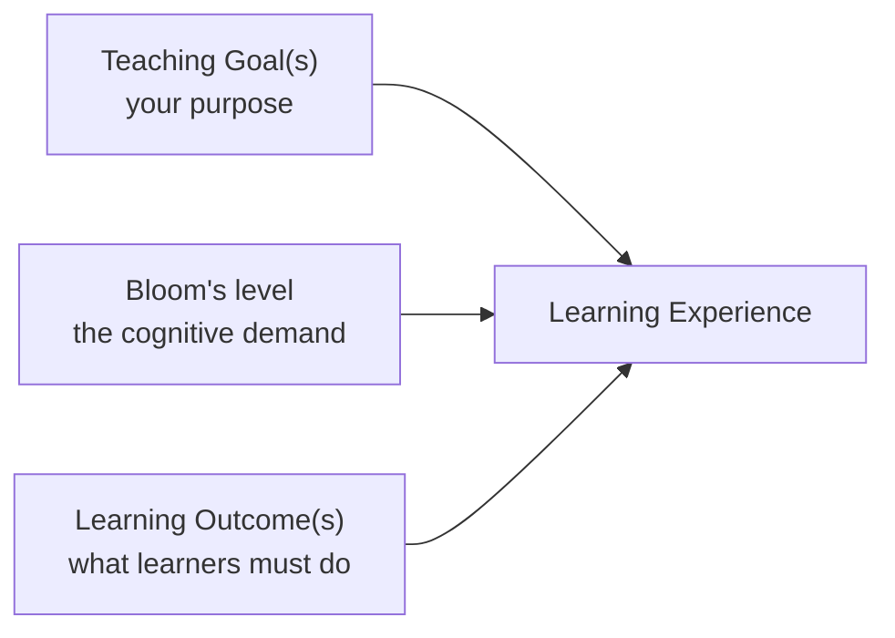
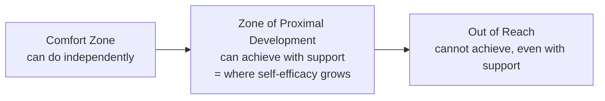
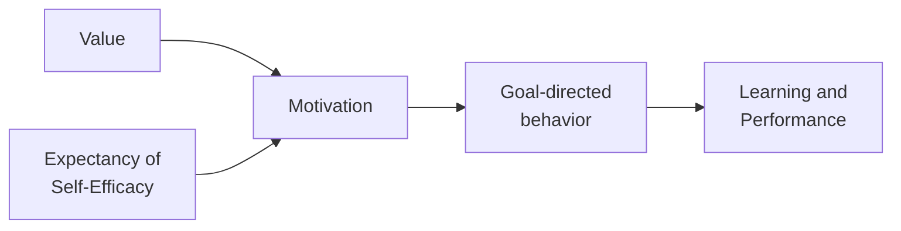

# Session 3 - Enhancing learner participation and engagement

## Presentation

Here you can find the presentation for this session:

<iframe src="https://docs.google.com/presentation/d/1gp8RFzKA6qmpbp3hOT8Mfsi2SV2E2alC/preview" width="640" height="360" allow="autoplay"></iframe>

The full presentation can be downloaded <a href="https://docs.google.com/presentation/d/1gp8RFzKA6qmpbp3hOT8Mfsi2SV2E2alC/edit?usp=sharing&ouid=117857355916723671329&rtpof=true&sd=true">[here]</a>.

## Session 3 - Part I - Introduction and Learning Outcomes

### Welcome and roadmap

Session 3 shifts focus to learner participation and engagement. It encourages trainers to think beyond lecturing, and to design training that requires learners to participate, practise, reflect, and interact.

A central theme of this session is the shift from the trainer as the **"sage on the stage"** to the trainer as the **"guide on the side."** This doesn't mean trainers should never explain or present information - it means effective training creates opportunities for learners to actively work with the material, rather than just receive it.

The session also addresses **motivation**: for learners to engage meaningfully, they need to perceive value in the learning goal, believe they can succeed, and feel the learning environment is supportive. These elements are closely tied to learner confidence, participation, and persistence.

!!! tip "For trainers running this session"
    This session is especially important for TtT instructors specifically, because the course itself should *model* active learning. Participants should experience the kinds of activities they're being encouraged to use, and have the chance to reflect on how and why those activities work, and in which contexts.

### Learning Outcomes for Session 3

By the end of Session 3, you will be able to:

- Describe what makes training effective.
- Describe what makes a trainer effective.
- Identify some strategies that facilitate active, interactive, and collaborative learning.
- List factors of motivation and demotivation.
- Identify what instructors can do to motivate, and avoid demotivating, learners.

!!! tip "For trainers running this session"
    Two tips worth sharing with participants up front: you don't have to talk for learners to learn - probably the opposite, and this session explains why in detail. And if you can, don't teach alone - teaching in pairs is a genuinely rewarding and rich experience, both for you and for learners.

---

### Challenge - What makes training effective? What makes a good trainer?

!!! question "Challenge - What makes training effective? What makes a good trainer? (breakout rooms, 2 people per room, 10 min)"
    Recall concrete examples from your own past training experience - as a learner, or as a trainer - and share them with your colleague.

    Write in the shared notes:

    - 3 keywords for effective training.
    - 3 keywords for a good trainer.

    This can be done with sticky notes or in the shared doc.

### A good trainer and effective training

A good trainer is defined by how well they help people learn. Like any skill, training becomes easier with experience - but even without extensive experience, focusing on learners and supporting their learning process makes a session more effective.

Good training requires careful planning: defining clear **[Learning Outcomes](glossary.md#glossary-learning-outcomes)** and choosing **Learning Experiences** that help learners achieve them. This gives the course structure, and helps learners build and improve their understanding. Being aware of the needs, challenges, and group dynamics of each class also supports learning and encourages participation.

A good trainer, in short, will make their best effort to be **empathetic, accessible, engaging, and inspiring** - alongside setting clear Learning Outcomes and Learning Experiences.

This combination has real consequences: learners are more likely to achieve the Learning Outcomes, stay engaged throughout the course, and benefit from training that adapts when needed to meet their actual needs. Concretely, effective training is well designed, brings learners to the Learning Outcomes, creates engagement, and is genuinely adapted to the audience in the room.

Being empathetic and accessible also creates more opportunities for engagement - it allows learners to ask questions and reach out, which is an important part of training. If learners aren't engaging in questions or reflections, there are usually three possible reasons:

1. They don't feel comfortable approaching you.
2. The content is too easy for this group.
3. The content is too difficult for them.

!!! tip "For trainers running this session"
    Figuring out which of the three applies can be done by individually approaching learners during activities - casually talking with them about their process - while also creating space for them to ask questions privately.

### The GOBLET skills matrix for a trainer

The TtT taskforce of the Global Organisation for Bioinformatics Learning, Education and Training ([GOBLET](http://mygoblet.org)) developed a skills matrix for trainers, giving an overview of the major skills a good trainer should develop.[^1] Not every trainer needs every skill - that isn't the point. The matrix groups skills into four areas:

- **Communication** - verbal communication, written communication.
- **Planning & Management** - session planning, curriculum planning, event management.
- **Engagement** - flexibility in delivery, empathy with participants.
- **Expertise & Knowledge** - participant understanding and knowledge, knowledge of training methods, awareness of user application, subject knowledge.

Trainers often focus heavily on Communication and are less aware of their own level in the other three areas.

!!! tip "For trainers running this session"
    A few concrete notes per area, worth sharing:

    - **Communication:** be yourself, be authentic. Don't rush your speech, and mind your body language. Create space to pause and let learners catch up - it's easy to get excited and talk without pauses. Treat your presentation material as *support*, not the main source of information; combine key words or short phrases with images, and if you must use longer text, print it and give learners time to actually read it.
    - **Planning & Management:** covers more than Learning Outcomes and Learning Experiences - it includes assessing available time, physical space and resources, preparation info for learners, and prerequisites (see the [ELIXIR-Training-SPLASH](https://elixir-europe-training.github.io/ELIXIR-Training-SPLASH/) resource and the [training life cycle](session-2.md#part-i-introduction-and-learning-outcomes) from Session 2 for more).
    - **Engagement:** flexibility, empathy, and openness to learners' needs and struggles make all the difference here - covered in depth for the rest of this session.
    - **Expertise & Knowledge:** as in any field, you need to keep updating yourself - both in your subject matter (use cases, challenges, new applications) and in training methods and approaches themselves.

---

### Challenge - Reflect on your skills as a trainer

!!! question "Challenge - Reflect on your skills as a trainer (silent self-evaluation, 5 min, alone)"
    Examine the GOBLET skills matrix (in the shared notes) and reflect: in which area(s) do you feel you need to improve? What exactly should you work on?

    Write in the shared doc which skills you need to improve, in each area of the GOBLET matrix.

---

## Session 3 - Part II - From Lecturing to Active Learning

We'll now look at several training practices (from the trainer's point of view) - or Learning Experiences (from the learner's point of view).

### A paradigm change: watching Eric Mazur

A short (13-minute) video featuring Eric Mazur, professor of Physics at Harvard University, discusses a paradigm change: from traditional lecturing to active-learning-based approaches.

---

### Challenge - Reflect on Mazur's interview

!!! question "Challenge - Reflect on Mazur's interview (silent reflection, 2 min + 3 min discussion)"
    Write in the shared notes what impressed you in Mazur's interview.

!!! tip "For trainers running this session"
    Ask learners to identify which learning practices Mazur mentioned, and whether they can recognise the main features of this paradigm change. Discuss and comment on participants' answers afterward.

The lesson learned from Mazur's interview: learners who actively interact with the material, the teacher, and other learners will learn better and more, will better remember what they learn, and will be more able to apply their knowledge across different fields. In other words, for learning to actually occur, you should select teaching practices - Learning Experiences - that promote active, interactive, and collaborative learning: what Mazur calls **"learning by doing."**

### Lecturing vs. active learning

| | Lecture | Active learning |
|---|---|---|
| **Centred on** | Teacher | Student |
| **Flow of information** | Explanation -> Listeners (unidirectional) | Teacher <-> Student <-> Student |
| **Method** | One-directional explanation | Teaching by questioning |
| **Interaction** | Less interaction | High level of interaction |
| **Engagement** | Less engagement | More engagement |

Lectures, as traditionally used, are characterized by a unidirectional flow of information from one instructor to many learners - only rarely does information flow back to the instructor. This means an instructor isn't necessarily aware of whether the information is actually "sedimenting" in learners' minds, and could in principle speak for hours in unidirectional mode. Some students might dare to ask a question, but the dynamic isn't really designed to invite many.

There are situations where a lecture format is genuinely appropriate - short presentations, speaker line-ups, congress presentations - but for a training session, a long lecture is probably not the most effective choice.

Active learning, by contrast, is highly interactive and engaging, with the teacher as a facilitator rather than the main event. You teach by questioning - having learners think, answer, and ask further questions - and can propose collaborative work, incentivize discussion, and create many opportunities for interaction among and with learners.

!!! tip "For trainers running this session"
    If participants start wondering "how do I choose the right active learning technique? Is there an ideal one I should learn?" - the honest answer is coming up in the next section, and it may not be what they expect.

### What is active, interactive, and collaborative learning?

> Active learning is anything course-related that all students in a class session are called upon to do other than simply watching, listening, and taking notes.[^2]

In other words: active in-class learning is anything all learners are invited to *do* - less watching, listening, and note-taking, more genuine participation. Strategies include (but aren't limited to) brief question-and-answer sessions, discussion integrated into a lecture, impromptu writing assignments, hands-on activities, and experiential learning events.

Why it matters: learners who actively engage with course material end up retaining it for much longer than they otherwise would, and are better able to apply their knowledge broadly.[^3] Active engagement increases the links between pieces of information, and the more complex those linkages, the better and more broadly learners can apply new knowledge - reinforcing both the links and the memory itself, and to some extent building analytical capacity too.

---

## Session 3 - Part III - Choosing the Right Teaching Practice

### There is no single ideal technique

There is no "ideal" teaching technique, nor a single "most effective" one. Recall Nicholls' steps of curriculum design from Session 2: it's essential to align Learning Experiences with the Learning Outcomes of your course. For each LO, identify the Learning Experience(s) that will best support achieving it.

More generally, choosing an appropriate Learning Experience comes down to three criteria:

1. **Define your Teaching Goal(s).** What is your purpose - to inspire learners? To ensure they remember a concept? You can translate this into Learning Outcomes.
2. **Use Bloom's level to support your plan.** Each level comes with specific requirements for what learners need to actually do.
3. **Choose the Learning Experience.** The experience needs to genuinely support achievement of the LOs - a lecture isn't suitable for teaching learners to *implement* an algorithm. It may show them how, so they can *describe* how to do it, but if you want them to actually be able to do it, you need a Learning Experience where they get to practise the implementation itself.

!!! tip "For trainers running this session"
    Recall [Bloom's Taxonomy](glossary.md#glossary-blooms-taxonomy) from Session 1 - created in 1956, and revised in 2001 into the Revised Bloom's Taxonomy (RBT) to better fit modernized training approaches. The six levels (Remember, Understand, Apply, Analyze, Evaluate, Create) are unchanged in principle; the revision mainly made the framework easier to understand and implement, and moved to explicitly active verbs for each level.

### Seven types of Learning Experiences, mapped to Bloom's levels

Inspired by Eric Mazur and active learning, here are seven Learning Experiences (teaching practices, from the trainer's point of view) worth considering, along with which Bloom's levels each one typically reaches, and what it can achieve:

| Learning Experience | Typical Bloom's levels reached | What it can stimulate | Example Learning Outcome |
|---|---|---|---|
| Lecture, webinar | Remember, Understand | Inspire, provide overview, give context, summarize | Summarize the take-home message |
| Exercise, practical lesson | Understand, Apply | Content digestion, knowledge application, show how | Calculate the area of a rectangle |
| Flipped classroom | Understand, Analyze | Analyse material, critical thinking, formulate questions, memorise new concepts | Formulate 3 questions about "the topic" |
| Peer instruction | Understand, Create | Explain something, defend an argument, critical thinking, two-way feedback | Discuss and formulate a unique answer for the exercise |
| Group discussion | Remember, Evaluate | Questioning, collaboration, develop ideas, critical thinking | Argue in favor of or against "an idea" |
| Group work | Evaluate, Create | Collaboration, argumentation, two-way feedback, digest course content | Compare the advantages of each LE type in the shared doc |
| Problem solving | Remember, Evaluate, Create | Critical thinking, creativity, decision-making, troubleshooting | Diagnose the reason a plant's leaves are yellow and folded |

!!! tip "For trainers running this session"
    A lecture can, at best, inspire a learner or provide concepts - that's Remembering/Understanding territory. Continue explaining each Learning Experience in light of Bloom's taxonomy, using the examples above (or your own).

### A closer look: the flipped classroom

The flipped classroom moves direct instruction outside of class time, so in-class time can be spent on activity and application:

- **Before class** - learners prepare using specific materials tied to specific Learning Outcomes.
- **During class** - learners participate in activities, applying and discussing the knowledge they prepared beforehand.
- **After class** - checking understanding and extending learning; this can continue across several sequential classes rather than being a one-off.

!!! tip "For trainers running this session"
    This is the standard approach, but you can adapt it to your own style. A few practical tips: flipping a class requires a lot of preparation. Explain the method to learners and make an explicit "agreement" with them - they commit to working through the materials you give them beforehand, and you commit to keeping those materials genuinely manageable. Don't start by flipping an entire course - start small, test it, and build up from there.

### A closer look: peer instruction, group discussion, and group work

| | Peer instruction | Group discussion | Group work |
|---|---|---|---|
| **Group size** | 1-to-1 | 2 or more | 2 or more |
| **Dynamic (example)** | Introduce a new topic, then a multiple-choice activity | Discuss and decide on one answer for all | An activity or action producing one solution or product |
| **Assessment** | Students instruct and teach each other | Corrections with the trainer | Assessment by the trainer |

!!! tip "For trainers running this session"
    Peer instruction is described here in its "traditional" form, but you can implement it creatively. A short video worth watching together with learners, after explaining how "classical" peer instruction works: Concept Tests at avanti's Learning Centre in Kanpur.[^4] A quick explainer on peer instruction more broadly, in French with English subtitles, is also worth a look before deciding whether to show it to learners.[^5]

### Other teaching practices for active learning

A further list of practices worth knowing (and, ideally, practising): brief question-and-answer sessions, think-pair-share, taking notes together / shared notes, pair programming, brainstorming, hands-on activities.

---

### Challenge - Evaluate strategies for active learning

!!! question "Challenge 3.4 - Evaluate strategies for active learning (4 min + 7 min discussion, alone)"
    Classify the list of active learning strategies (in the shared doc) into: Practiced (P), Known (K), Unknown (U).

    Share your experience - which have you actually practiced? Which do you know but never practiced? Which don't you know at all?

!!! tip "For trainers running this session"
    Follow with a Q&A session and discussion.

### What have we learned about teaching practices?

The take-home message: first reflect on your **Teaching Goal**, write your **Learning Outcomes** and identify their corresponding **Bloom's level**, then select Learning Experiences that will let learners achieve those LOs. Always remember that learning occurs **by doing** - learners will only be able to *describe* something if they've had the chance to practise it; they'll only be able to *apply* a rule after having applied it themselves, and to successfully practise applying a rule, they must first remember it, understand it, and have seen examples of how it's used.

There are also many other practices you can naturally incorporate to support interactivity, a positive and engaging learning environment, active and collaborative learning, stimulating lessons, and frequent feedback:

- Have students do recaps - organise recap sessions at the end of a lesson, or the start of the next, with learners actively involved (you can ask them to do the recap themselves).
- Pay attention to the classroom environment, in-person or online.
- Assess prior knowledge and mental models, to tailor the lesson to learners' actual needs, address misconceptions, and learn about your learners.
- Introduce challenges or games - but learn how to use gamification well before relying on it heavily; done right, it's a genuinely powerful, engaging technique.
- Start with introductions - they set the stage for learning.
- Collect instant feedback (more on this in Session 4).
- Avoid teaching alone, whenever possible. There are different models for co-teaching: alternating topics or sessions, or being the main trainer with one or more helpers in the room. With two or more trainers, the class can be observed from different angles, making it easier to spot learners who are struggling or falling behind, and to offer one-to-one support without stopping the lesson's flow. It's also important that co-trainers give each other feedback.
- Repeat questions aloud, so everyone in the room heard and understood them.
- Learn learners' names, and use them.
- Introduce physical exercises, or plan short relaxing breaks - even a one-minute stretch or short meditation in a day-long course. It may feel a little unusual to lead, but learners tend to genuinely appreciate it, and it helps create a relaxed classroom climate.
- Use blended, multimedia materials to create engaging activities.

!!! tip "For trainers running this session"
    Note: several of these strategies (working together on exercises, closing knowledge gaps, minimizing computer use, assigning prior reading as a prerequisite, providing assistants or progressive difficulty, having extra exercises ready) are the same ones that came up when we discussed avoiding working-memory overload back in [Session 1](session-1.md#challenge-avoid-overload) - a good sign that these practices genuinely reinforce each other across different parts of the course design.

---

### Challenge - Link teaching practices, Learning Outcomes, and Bloom's levels

!!! question "Challenge - Link teaching practices, Learning Outcomes, and Bloom's levels (in groups, 7 min + 7 min discussion)"
    Using the list of techniques in the shared doc, identify the highest Bloom's level supported by each technique.

!!! tip "For trainers running this session"
    Follow with a Q&A session and discussion.

[^1]: GOBLET - Global Organisation for Bioinformatics Learning, Education and Training, [mygoblet.org](http://mygoblet.org).
[^2]: Felder, R.M., & Brent, R. (2009). Active Learning: An Introduction. *ASQ Higher Education Brief*, 2, 4-9.
[^3]: Waldrop, M.M. (2015). Why we are teaching science wrong, and how to make it right. *Nature*, 523. See also: Prince, M. (2004). Does Active Learning Work? A Review of the Research. *Journal of Engineering Education*, 93, 223-231.
[^4]: Concept Tests at avanti's Learning Centre in Kanpur, [youtube.com/watch?v=2LbuoxAy56o](https://www.youtube.com/watch?t=1&v=2LbuoxAy56o).
[^5]: Peer-to-peer or peer-learning: what is it?, [youtube.com/watch?v=MYa4hgcMRNc](https://www.youtube.com/watch?v=MYa4hgcMRNc). See also: [journals.physiology.org/doi/full/10.1152/advan.00045.2021](https://journals.physiology.org/doi/full/10.1152/advan.00045.2021).

---

## Session 3 - Part IV - Motivation: Value, Expectancy, and Environment

Motivation is one of the most critical factors in learning. It represents the personal investment learners make in reaching desired outcomes, and directly influences the direction, intensity, persistence, and quality of their learning behaviors. Understanding motivation helps instructors create conditions that support engagement and deep learning.

Motivation is personal, and it's genuinely difficult to work with deeply demotivated learners - often, trainers can't do much about a deep lack of motivation on their own. What this section focuses on is what trainers *can* do: enhance motivation where possible, and avoid demotivating learners in the first place.

---

### Challenge - Recall a motivating learning experience

!!! question "Challenge - Recall a motivating learning experience (silent reflection, 3 min + 3 min discussion)"
    Write in the shared doc about a motivating experience in your life as a learner, how it impacted you, and - if you can - what made it motivating.

!!! tip "For trainers running this session"
    While learners write, read through their notes and comment, asking questions about what made the experience motivating, what motivation means to them, and what behaviors or feedback they think are motivating. The goal is to help the group notice that what they personally find motivating is likely to be motivating for their own learners too - this discussion bridges naturally into the rest of this section.

### What is motivation?

> Motivation is personal investment to reach a desired outcome.[^6]

Herbert Simon - Nobel laureate and one of the founders of the cognitive sciences - reminds us that **learning results only from what learners do and think**; a trainer can only try to *influence* that, never control it directly. Ambrose et al. put this more specifically: students' motivation generates, directs, and sustains what they do to learn.[^7] This is the same idea as [P4 from Session 1](session-1.md#part-iv-evidence-based-principles) - motivation determines, directs, and sustains what learners do to learn - seen here in more depth.

### Goals: the basic feature of motivation

Saying someone "is motivated" tells us little unless we say what they're motivated *to do*. Goals are the basic organizing feature of motivated behavior - they act as a compass, directing purposeful action. Learners typically hold multiple goals at once: acquiring knowledge and skills, making friends, demonstrating intelligence, gaining independence, having fun.

Five common types of goals:

- **Learning goals** - genuinely gaining competence and understanding.
- **Performance goals** - protecting self-image, projecting a positive reputation (passing exams, appearing intelligent, gaining recognition).
- **Work-avoidant goals** - finishing quickly with minimal effort.
- **Social goals** - making friends, connecting with others.
- **Affective goals** - engaging in stimulating activity.

Learners' goals for themselves may differ from an instructor's goals for them - and it's worth remembering they may also differ from the goals the instructor themselves had, back when they were a student. Motivation is highest when an activity satisfies more than one goal at once, and the learning situation is especially powerful when learners' and instructors' goals genuinely align.

### Value: a goal's importance

**Value** is a goal's subjective importance, and one of two key pillars of motivation (the second is expectancy, below). There are three sources of value, which can combine and reinforce each other rather than conflict:[^8]

- **Attainment value** - the satisfaction of mastery and accomplishment (e.g. satisfaction from solving a complex problem, simply to prove you can).
- **Intrinsic value** - satisfaction from doing the task itself (e.g. satisfaction from writing a computer program that works).
- **Instrumental (utility) value** - how much an activity helps achieve other important goals - extrinsic rewards like praise, recognition, an interesting career, or a good salary.

### Expectancy of self-efficacy

Value alone isn't enough to motivate behavior - learners also need to believe they can actually succeed. This is **expectancy**, and it comes in two forms:[^8]

- **Outcome expectancies** - the belief that specific actions (especially hard work - a growth mindset) will bring about the desired outcome.
- **Efficacy expectancies** - the belief that you're capable of identifying, organizing, initiating, and executing the actions needed to get there.

Even a highly valued goal won't motivate someone who doesn't expect to succeed at it. Learners' expectations are strongly shaped by prior experience in similar contexts - and motivation, effort, and persistence tend to be highest among learners who attribute their past successes to a combination of ability *and* effort, rather than to ability alone.

### The Zone of Proximal Development

Vygotsky's **Zone of Proximal Development (ZPD)** connects directly to motivation through self-efficacy.[^9]

- The **comfort zone** is what a learner can already do independently.
- The **ZPD** is the gap between what a learner can do alone and what they can achieve with expert support - this is where appropriate challenge, and self-efficacy, actually develop. Tasks here are challenging but attainable with reasonable effort and support.
- Beyond the ZPD lies what's genuinely **out of reach** - tasks learners can't achieve even with support. When a goal is perceived as impossible, motivation plummets regardless of how much the learner values it.

In other words: some discomfort is necessary to learn something new, but if that discomfort isn't bearable - or even a little enjoyable - learning won't happen, since the learner becomes demotivated instead. Designing Learning Experiences that sit within a learner's ZPD builds both competence and confidence at once.

### Putting the model together

Motivation, in full: goals are shaped by the five types above; value and expectancy of self-efficacy interact to produce motivation; motivation leads to goal-directed behavior; and that behavior supports actual learning and performance.

Value and expectancy are two key pillars of motivation - but, as the next section shows, they're not sufficient on their own.

### A third pillar: the learning environment

Recall [P7 from Session 1](session-1.md#part-iv-evidence-based-principles): the classroom environment can profoundly affect learning, positively or negatively. A learner's current developmental level interacts with the social, emotional, and intellectual climate of a course to shape learning - and this climate isn't just background context, it's an active force. When learners perceive an environment as hostile, unwelcoming, or unsupportive, their willingness to take intellectual risks, engage deeply, and persist through challenge diminishes significantly - regardless of how strong the other two pillars are.

A few concrete aspects that shape this climate:

- **Stereotypes and discrimination.** Even well-intentioned assumptions - e.g. giving certain groups extra or less support based on a belief that some groups are innately better or worse at a subject - are a subtle, hard-to-detect form of bias, and can be genuinely demotivating.
- **Dismissive language.** Words like "just," "simply," or "obviously," or reactions like "don't you know?" or "I can't believe you don't know this," can be demotivating or offensive - especially to learners outside whatever group the language implicitly assumes as the default.
- **Complex class dynamics.** A more experienced learner who wants to answer every question can make less confident learners even shyer to participate; a learner with very narrow, specific questions can inadvertently narrow the whole discussion. These dynamics happen somewhat beyond your control, but are worth observing and managing.
- **Inclusivity and accessibility.** Consider dyslexia, colour blindness, hearing difficulties, wheelchair access, and similar needs - in your materials (dyslexia-friendly fonts, colourblind-friendly palettes), your venue, and your own approach as a trainer. A pre-course survey asking about specific needs (a sign-language interpreter, a microphone) goes a long way, and creating a genuinely inclusive space makes it easier for learners to approach you with questions - sometimes literally by walking over and asking quietly, rather than in front of the whole room.
- **Growth vs. fixed mindset.**[^10] Someone with a growth mindset sees intelligence and ability as learnable and capable of improving through effort; someone with a fixed mindset sees the same traits as stable and unchangeable. Communicating a growth mindset - that ability develops through effort - helps learners attribute setbacks to controllable factors (effort, strategy) rather than to stable traits ("I'm just not smart enough"), which shapes their expectancies for future success and their motivation to keep trying.

!!! tip "For trainers running this session"
    Recommended background reading before teaching this section: Lovett et al., *How Learning Works*, chapter 4 (on classroom climate), and the Carpentries Instructor Training episode on Equity, Inclusion, and Accessibility.[^11]

### The three pillars of motivation

Value, expectancy, and environment are the three pillars supporting motivation - which itself rests on the foundation of goals. Like architectural pillars, if any one is weak or missing, the whole structure becomes unstable. Instructors can influence all three, and neglecting any one of them can substantially reduce motivation, regardless of strength in the other two.

For fully motivated learners: they need to see the value, their self-efficacy needs to be high, and the environment needs to be supportive.

The interaction between these three pillars produces a range of recognisable learner behaviors, depending on whether value and expectancy are high or low, and whether the environment is supportive or not:[^12]

| Value | Expectancy (self-efficacy) | Environment | Resulting behavior |
|---|---|---|---|
| Low | Low | Either | **Rejecting** - the goal is seen as both unimportant and undoable. Learners disengage, showing apathy, passivity, or even anger if the environment feels coercive. |
| High | Low | Not supportive | **Hopeless** - the goal matters, but seems undoable with no support available. Very low motivation, helpless behavior. |
| High | Low | Supportive | **Fragile** - wants to succeed, perceives support, but doubts their own chances. May feign understanding, avoid overt performance, deny difficulty, or make excuses to protect self-esteem. |
| Low | High | Either | **Evading** - sees the task as doable but unimportant. Difficulty paying attention, social or daydreaming distraction, doing only the minimum needed to avoid disapproval. |
| High | High | Not supportive | **Defiant** - values the goal and is confident, but perceives no support - may take an "I'll show you" or "I'll prove you wrong" stance. |
| High | High | Supportive | **Motivated** - the optimal state. Learners genuinely seek to learn, integrate, and apply new knowledge, and see learning situations as opportunities to extend their understanding. |

!!! tip "For trainers running this session"
    This table is the actual goal of instructional design: help learners see value, build positive expectancies, and create a genuinely supportive environment - all three, together, are what produce the "Motivated" outcome in the bottom row.

---

## Session 3 - Part V - Avoiding Demotivation and Practical Strategies

Motivation and demotivation are closely connected. Adult learners usually arrive at a course already motivated - so in many cases, simply *not demotivating* them is itself an excellent way to support their motivation.

---

### Challenge - Recall a demotivating learning experience

!!! question "Challenge - Recall a demotivating learning experience (silent reflection, 3 min) - optional, time permitting"
    Write in the shared doc about a demotivating experience in your life as a learner, and how it impacted you.

!!! tip "For trainers running this session"
    Only run this challenge if there's enough time left for the next one - it's explicitly marked as time-permitting in the source material, since the strategies Challenge that follows matters more. If you do run it, comment on learners' demotivating experiences, and try to identify and highlight typical "patterns of demotivation" together.

### Strategies to improve motivation and avoid demotivation

Motivation is personal, and it's genuinely difficult to work with deeply demotivated learners - trainers often can't do much about a deep lack of motivation. But that's not always true: there are concrete things a trainer can do to support learners' motivation and avoid demotivating them. Using stereotypes, for instance, will demotivate learners with minority status - which is exactly why the previous section's points on classroom climate matter so much here.

---

### Challenge - Strategies to improve motivation

!!! question "Challenge 3.8, part 1 - Strategies to improve motivation (5 min, in 3 groups)"
    Read, in the shared doc, the strategies to increase learner motivation and avoid demotivating them.

!!! question "Challenge 3.8, part 2 - Strategies to improve motivation (5 min in groups + 10 min discussion)"
    Each group picks one or more strategies from one of the three pillars (value, expectancy, environment).

    Think of a concrete example of what you could actually do or say to implement that strategy in the classroom, for discussion with the whole group.

A concrete list of strategies to draw on for this challenge - several of which should look familiar from [Session 1](session-1.md#challenge-avoid-overload) and from the "other supporting practices" discussed earlier in this session:

- Work together on exercises, and repeat ideas during peer discussion.
- Actively try to close knowledge gaps rather than let them accumulate.
- Keep computer use in the classroom to a minimum, when it isn't strictly needed.
- Assign prior materials to read at home, effectively setting a prerequisite.
- Provide assistants, or build in progressively increasing difficulty.
- Have additional exercises ready for learners who move faster, or who need more support.

### Things to avoid

- **Deliver long, unidirectional lectures.**
- **Dive into technical discussions with only one or two participants** - especially if the discussion is complex or detailed, this leaves everyone else disengaged.
- **Pretend to know more than you actually do.**
- **Hinder learner autonomy.**
- **Use diminishing language, or feign surprise** - words like "just," "simply," "obviously," or reactions like "don't you know?", "really?", or "I can't believe you don't know this." Saying something dismissive about a technology or application (e.g. implying that using a particular tool is "for losers") falls in the same category. As covered above, unaware use of this kind of language - often unconsciously shaped by whichever group is treated as the unremarkable "default" - can be demotivating or offensive to learners outside that default group.

### Things to do

- **Make prerequisites explicit** - even so, levels of knowledge among learners will still vary.
- **Emphasize a growth mindset** - what matters is the *rate* at which learners are progressing, not some fixed starting ability.
- **Be mindful with your words** - when explaining negative perceptions, correcting mistakes, or giving feedback.
- **Share anecdotes** - your own mistakes, and things you struggled to learn or do yourself.
- **Be aware of impostor syndrome** - both your own, and the possibility that learners are experiencing it.
- **Encourage pair programming and group work.**

---

### Before Session 4

As a warm-up for the next session: read the "Random Thoughts" reader-view excerpt on the seven principles of *How Learning Works* (Ambrose et al., 2010), and write one question you have in the shared notes.

!!! tip "For trainers running this session"
    Further resources for this session: *How Learning Works* (Ambrose et al., 2010); *Understanding How We Learn* (Weinstein & Sumeracki, 2018 - see [Session 1](session-1.md#part-v-six-learning-strategies)); The Carpentries Instructor Training; and *Teaching Tech Together* (Wilson, 2019), both a book and a website at [teachtogether.tech](https://teachtogether.tech/).

[^6]: Maehr, M.L., & Meyer, H. (1997). Understanding motivation and schooling: Where we've been, where we are, and where we need to go. *Educational Psychology Review*, 9(4), 371-409.
[^7]: Ambrose, S.A., Bridges, M.W., DiPietro, M., Lovett, M.C., & Norman, M.K. (2010). *How Learning Works: Seven Research-Based Principles for Smart Teaching* (p. 76). Wiley.
[^8]: Wigfield, A., & Eccles, J.S. (2000). Expectancy-value theory of achievement motivation. *Contemporary Educational Psychology*, 25(1), 68-81.
[^9]: Vygotsky, L.S. (1978). *Mind in Society: The Development of Higher Psychological Processes.* Harvard University Press.
[^10]: Dweck, C.S. (2012). *Mindset: How You Can Fulfill Your Potential.* Constable & Robinson.
[^11]: The Carpentries Instructor Training, [Equity, Inclusion, and Accessibility](https://carpentries.github.io/instructor-training/09-eia/index.html).
[^12]: Redrawn from: Ambrose, S.A., Bridges, M.W., DiPietro, M., Lovett, M.C., & Norman, M.K. (2010). *How Learning Works: Seven Research-Based Principles for Smart Teaching.* Wiley.

---

## Session 3 - Summary and Key Takeaways

Session 3 turned to the human side of training: how learners actually participate, and what makes them want to.

**The shift from "sage on the stage" to "guide on the side"** runs through the whole session. Effective training and effective trainers share a common thread: clear Learning Outcomes and Learning Experiences, delivered with empathy, accessibility, and genuine adaptability to the audience in the room. There's no single ideal teaching technique - the right choice always depends on your Teaching Goal, the Bloom's level you're targeting, and the Learning Outcome you're working toward, which is why this session walked through seven different types of Learning Experience rather than recommending just one.

**Motivation turned out to have real structure**, not just "learners either want to learn or they don't." Three pillars - value, expectancy of self-efficacy, and a supportive environment - combine to produce recognisably different learner behaviors, from fully "motivated" down to "rejecting," "hopeless," "fragile," "evading," and "defiant." Since a trainer can genuinely influence all three pillars, this gives concrete levers to pull, rather than leaving motivation as something mysterious or entirely out of your hands.

**And demotivation deserves as much attention as motivation itself.** Adult learners usually arrive already motivated - so very often, the most effective thing a trainer can do is simply avoid demotivating them: watch for stereotypes, dismissive language, and unsupportive dynamics, and lean instead into explicit prerequisites, a growth mindset, and genuine humility about your own expertise.

Before Session 4, take a moment to read the excerpt from *How Learning Works* and note down a question it raises for you.

