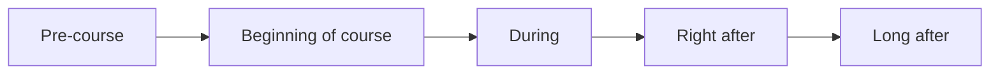
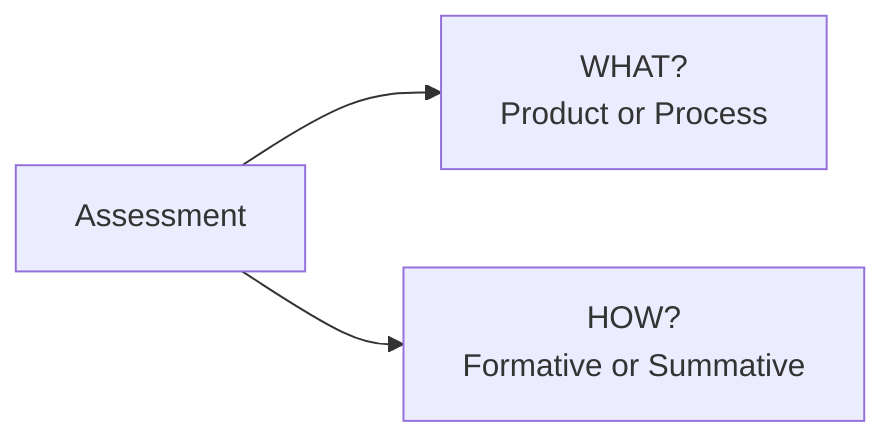
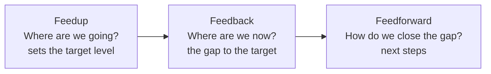
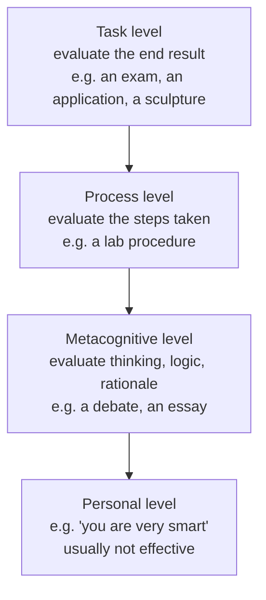

## Presentation

Here you can find the presentation for this session:

<iframe src="https://docs.google.com/presentation/d/1IxrzlVxy0gQS8D3AxdDCHrtejRuMMPXt/preview" width="640" height="360" allow="autoplay"></iframe>

The full presentation can be downloaded <a href="https://docs.google.com/presentation/d/1IxrzlVxy0gQS8D3AxdDCHrtejRuMMPXt/edit?usp=sharing&ouid=117857355916723671329&rtpof=true&sd=true">[here]</a>.

## Session 4 - Part I - Introduction and Learning Outcomes

### Welcome and roadmap

This final core session focuses on **assessment** and **feedback** as essential parts of the learning process. Assessment is presented not only as a way to judge whether learning has taken place, but as a way to *support* learning while it's happening. Usually, trainers give feedback to learners, while trainers *receive* feedback from learners - and in both directions, giving or receiving feedback requires making an assessment of a given situation first.

The session emphasises the importance of **frequent feedback**. Since attention and engagement can fluctuate during training, trainers should build in regular opportunities to check understanding, refocus learners, and identify areas of difficulty - short feedback loops let you respond to learners' needs before problems grow too large.

The session also covers how to receive and use feedback on your *own* teaching. Negative or critical feedback can be difficult to hear, but it's also a valuable source of information for reflective practice - TtT encourages approaching feedback not as a personal attack, but as an opportunity to improve your training design and facilitation.


For TtT instructors specifically: this session is a chance to reinforce that assessment, feedback, and evaluation should be planned from the very beginning of course design - not bolted on at the end as an afterthought.



### Learning Outcomes for Session 4

By the end of Session 4, you will be able to:

- **Describe** the differences between formative and summative assessment.
- **Explain** why frequent feedback is important.
- **Describe** and **exemplify** a few techniques for formative assessment.
- **List** a few techniques to cope with feedback on your own teaching efforts.


Take the opportunity, once again, to recall how action verbs from [Bloom's Taxonomy](glossary.md#glossary-blooms-taxonomy) help define what learners are expected to be able to do after a course.



### Key concepts: assessment and feedback

Two key concepts sit at the heart of this session: **[assessment](glossary.md#glossary-assessment)** and **feedback**. Let's start by defining them.

---

## Session 4 - Part II - What Is Assessment?

### Defining assessment

From the Cambridge Dictionary: assessment is *the act of judging or deciding the amount, value, quality, or importance of something, or the judgment or decision that is made.* Translated to a training context, we can assess, for instance, learners' current knowledge, how they're progressing through the learning process, their performance, and also the quality and efficiency of the teaching itself.

Assessment is **bidirectional** - it's used by both instructors and learners:

- **Used by instructors** - to gauge learners' current state of learning, and the quality of the output of a learning gain.
- **Used by learners** - to gauge the quality, pertinence, and adequacy of the training session, their interaction with the instructor, and the course material.

There are different types of assessment, and different ways to categorize them. But why assess at all? By assessing a learner's current knowledge, abilities, or learning process, we can help them improve.

### Assessment and the timing of a course

One useful way to categorize assessment is by *when* it happens, relative to the course:


Before revealing the answer, steer a discussion: what would you, as trainers, try to assess in each of these time periods?



- **Pre-course** - verify the target audience: do they have the needed prerequisites, and are learner expectations aligned with trainer expectations?
- **Beginning of course** - a preventive check, adjusting the course to the reality of the participants actually in the room.
- **During the course** - assessing in real time whether learning is actually taking place.
- **Right after the course** - evaluation: measuring the knowledge and skills acquired.
- **Long after the course** - impact evaluation: measuring the adequacy, quality, and impact of the course over time.

This timing dimension gives us two named types of assessment:

- **[Formative assessment](glossary.md#glossary-formative-assessment)** - pre-course, preventive, and a continuous process throughout the course's duration.
- **[Summative assessment](glossary.md#glossary-summative-assessment)** - usually linked to grading of some sort, determining a learner's minimum achievement of a Learning Outcome; also used to measure the adequacy, quality, and impact of the course as long-term, strategic evaluation.

We'll dive deeper into both of these shortly.

---

## Session 4 - Part III - What Is Feedback?

### Defining feedback

**Feedback is information meant for improvement** - about a person's performance, a task, their knowledge, skills, competencies, or abilities. In teaching and learning specifically, feedback is more than just a comment - it helps identify strengths and areas for growth.

Feedback is **bi-directional**, just like assessment: it isn't just something trainers give to learners, it's also something trainers *receive*. This mutual exchange fosters a culture of learning, trust, and continuous development. When giving or receiving feedback, always aim to be specific and constructive.

### Feedback and the timing of a course

Looking again at the timing dimension, but for feedback specifically:

- **During the course** - feedback is usually the trainer's responsibility. The trainer assesses learners regularly, and uses that assessment to steer their learning process: giving feedback, adjusting pace, speed, and the types of learning activities used.
- **After the course** - feedback becomes the learner's responsibility, in two moments:
    - **Shortly after** - the learner provides **short-term feedback**: an "end of course" assessment measuring the quality and adequacy of the course and the trainer.
    - **Long after** - **long-term feedback**, measuring the actual impact and lasting change the course had on the learner. This is usually the hardest feedback to collect, since learners are least likely to answer surveys long after a course - but for trainers and training facilitators, it's genuinely important, since it indicates the real impact of your courses and helps inform strategic decisions.

---

### Challenge - Diagnostic Assessment


Discuss how you could collect information about learners' prior knowledge - before, and at the beginning of, a course - and how you could use that information.

Write your discussion in the shared notes.




Break-out rooms of 2-5 people work well here, depending on group size - decide this in advance. Pre-course assessments are useful for finding out where a group of learners actually stands at the start of a course: they help set realistic Learning Outcomes, meet learner expectations, and adapt content to fill identified gaps (while avoiding time spent on topics that aren't actually necessary). Diagnostic questionnaires can be anonymous or not: anonymous questionnaires give a sense of the whole group's level; non-anonymous ones let you find out whether a *specific* learner has the needed prerequisites, so you can adjust your teaching accordingly if not.



### Assessment vs. feedback: what's the difference?


Open this up as a discussion: ask learners, in the classroom, whether they can articulate the difference between assessment and feedback. Use the moment to correct any misconceptions that come up.



---

## Session 4 - Part IV - How and What to Assess: Formative vs. Summative

### Two dimensions of assessment

Assessment can be broken into two dimensions:

**What are we assessing - product or process?**

- **[Product assessment](glossary.md#glossary-product-process-assessment)** focuses on the final, tangible outcome learners produce: a model, a gymnastics routine, a project, an assignment, an exercise, a painting.
- **Process assessment** focuses on *how* learners engage with the learning experience: their attitudes, social-relational skills, problem-solving ability, creativity, use of methods or strategies, progress over time - even the instructor's own didactic process.

While the product shows achievement, the process reveals growth, effort, and deeper learning behaviors. Ideally, aim for both, to get a more complete picture of learning.

**How are we assessing - formative or summative?**

| | Formative | Summative |
|---|---|---|
| **Timing** | Throughout the learning process | At the end of an instructional period |
| **Purpose** | Gauge learning and provide instant feedback | Evaluate overall achievement (of the Learning Outcomes) |
| **Frequency** | Frequent and ongoing (daily, weekly) | Infrequent - usually a few times per course |
| **Examples** | In-class discussions, weekly quizzes, polls, surveys, exit tickets, homework, group work, self- and peer-assessments | Instructor-created exams, final essays, final presentations, final reports, final projects, portfolios |
| **Does not** | Provide evidence for grading | - |
| **Does** | Help learners become aware of the focus, and improve the quality of their learning | Compare against standards or benchmarks; provide evidence for grading |

Formative assessment is like a GPS - it helps you adjust your route while you're still on the journey. Summative assessment is like a snapshot - it captures what learners have achieved once the journey is complete. Both are valuable: formative helps learners grow, summative helps measure that growth, and together they support a complete picture of learning.[^1]


Note that for summative assessment, "the end" doesn't necessarily mean the end of an entire course - summative assessments can be distributed throughout a course, after a particular unit or topic has been taught and graded.

Common summative methods: tests, interviews, observations, questionnaires, projects. **For this TtT course specifically, the focus from here on is formative assessment** - collecting information and feedback on how learning is progressing.



### Formative assessment: what to collect

Formative assessment means collecting information about learners' learning progress. What are we actually collecting?

- **Goals and objectives** - are learners' own goals aligned with the course's goals and outcomes?
- **Prior knowledge** - which knowledge gaps need filling before moving on?
- **[Mental models](glossary.md#glossary-mental-model)** - are learners' mental models correct?
- **Frequent mistakes** - which types of mistakes need special attention?
- **Ability to perform a task** - can learners actually apply what they've learned?

> When implemented well, formative assessment can effectively double the speed of student learning.[^2]

---

### Challenge - Formative Assessment


Discuss how you could collect information on learners':

- Goals and objectives
- Mental models
- Frequent mistakes

Write it in the shared notes.




This is more specific than the previous challenge. Challenge 4.1 asked learners to reflect on assessing prior knowledge in general; here, the focus narrows to three specific things: learners' own goals for attending the course, their mental models (broken or correct, about a specific topic), and common, frequent mistakes.



---

### Challenge - Multiple Choice Questions and Mental Models


For the question below, choose each wrong answer in turn and write down which misconception it likely reflects.

**Q: How much is 27 + 15?**

- 42
- 32
- 312
- 33




A well-designed multiple-choice question can reveal misconceptions, not just whether learners know the right answer.[^3] For this example: the correct answer is 42.

- **32** - the learner discarded the carried digit entirely.
- **312** - the learner knows they can't simply discard the carried '1', but doesn't understand it represents a ten that needs adding into the next column - they're treating each column as unconnected to its neighbors.
- **33** - the learner knows to carry the 1, but carries it back into the same column it came from, rather than the next one.

When designing multiple-choice activities, it's worth deliberately crafting wrong answers that reveal *what* learners misunderstood, not just *whether* they got it right.



---

## Session 4 - Part V - Tools and Techniques for Formative Assessment

Formative assessment and feedback can be done in many ways - asking learners questions and getting responses orally; asking them to describe the strategy they'd adopt for a problem; asking them to solve a problem in groups, or individually in front of the class; brainstorming and discussions; diagnostic questionnaires (multiple-choice questions, as we just saw, are one type). Several of these Learning Experiences were already introduced in [Session 3](session_3.md#part-iii-choosing-the-right-teaching-practice) - here we look at some concrete, practical tools for actually running them.

### Online tools

Tools like Socrative, Google Forms, and Mentimeter let you build questionnaires with open or multiple-choice questions, to assess knowledge online.

### In-class approaches

- **Fist of five** - learners hold up a number of fingers to indicate their confidence or agreement level.
- **Sticky notes** - popularized by the Carpentries: learners stick a green sticky note on their computer when they've finished an exercise, and a red one when they're blocked or need help. For online courses, emoji (green/red ticks, for example) work as a substitute.

Both approaches add dynamism to the classroom while assessing learners' knowledge in real time.

### Shared notes

Tools like Google Docs or Etherpad let learners collaboratively work on exercises, ask questions, and give opinions - you assess based on what they write. Useful for the output of group activities, exercises, opinions and ideas, and questions and answers.

### Asking questions and discussions

Ask learners questions orally, or start an open discussion - including in the context of group work, having groups discuss their own work. Brainstorming sessions, where learners spontaneously contribute ideas, work well here too.

### Group activities

Group work is a great way to assess *process*: solving problems in groups, doing exercises in front of the class, or asking learners to describe the strategy they'd use for a problem. It's also a good opportunity for learners to help each other.

### Self- and peer-assessment

Learners can also evaluate each other - through self-assessment, or peer evaluation. For peer evaluation specifically, make sure to set up strict rules and guidelines beforehand.

---

### Challenge - Integrating Formative Assessment Results


Thinking about this TtT course itself:

- How did the instructors assess your learning? Write it in the shared notes.
- Choose one of the feedback-collection techniques covered in the previous slides, and write how you could integrate its results into your own lesson, on the fly.



---

### Challenge - How Frequent Should Formative Assessment Be?


Thinking about this course: how many feedback opportunities have you had so far? How frequently do you think formative feedback should actually happen?

Take notes for a short review afterward.



---

## Session 4 - Part VI - Feedback Mechanisms and Giving Good Feedback

Feedback mechanisms run both ways: trainer to learners, and learners to trainer.

### A triangulated model of teaching evaluation

A model developed by Cardona (2021) frames feedback about a trainer's own efforts as genuinely multidirectional: trainers can receive feedback on their teaching from learners, from peers, and through self-assessment.[^4] Using multiple methods (triangulation) for data collection helps ensure the validity of the results - multi-method approaches tend to work better than relying on just one, both because they allow triangulation and because they better capture the real complexity of teaching.

One important, learnable skill: giving good feedback well, and teaching others to do the same. A simple strategy worth remembering: **one positive, one negative** - or "one up, one down." Key message when giving feedback: be positive, be specific, give a next step.

### Feedup, Feedback, and Feedforward

When talking about feedback in education, it helps to distinguish three interconnected types, based on what each one focuses on:[^5]

- **Feedup** - focuses on the target level: what are we aiming for? Sets learning goals and clarifies expectations. *Example: "By the end of this module, you should be able to analyze DNA sequencing data."*
- **Feedback** - focuses on the current level: where is the learner now? Identifies the gap between current performance and the target. *Example: "You've correctly identified the sequencing steps; I noticed you missed the error-checking phase."*
- **Feedforward** - focuses on how to close that gap: what strategies or actions will help the learner improve? Future-oriented, and supports progress. *Example: "Try using the checklist to make sure all sequencing steps are covered."*

### Feedback levels

Feedback can also be aimed at different levels:

If your feedback reaches the **personal level** - praising or criticizing the person rather than the task, process, or thinking behind it - you've probably gone too far. It's generally not effective, and can even be counter-productive, though in some specific cases it may work for pure encouragement.

### What makes feedback effective

- **Frequent** - gives learners the opportunity to course-correct.
- **Immediate** - minimize the time between the assessment and the feedback, so learners don't have time to forget what they did.
- **Specific** - name exactly what, and when, went wrong.
- **Detailed** - give enough information for learners to actually understand what they did wrong and how to improve.

### Setting good goals

- **Clear** - gives learners the opportunity to course-correct.
- **Measurable** - learners need a specific target, and a way to find out for themselves whether they've achieved it.
- **Achievable and challenging** - if a goal isn't achievable, learners lose motivation entirely; if it isn't challenging, they won't progress or adapt to new scenarios. The balance matters.
- **Quality instructions** - knowing what you did wrong isn't enough; learners need to know the steps to actually correct it.

### Dealing with (bad) feedback from trainees

Humans tend to focus more on negative feedback than positive - as a trainer, receiving feedback from trainees, it's easy to fall into the same trap. Try to see bad feedback not as a burden, but as an opportunity to grow:

- **Take a deep breath.** It helps you avoid the pull of negative emotion and stay rational.
- **Try to see the point in the criticism - learn from it.** Even if a trainee didn't phrase it well, they may still have a point.
- **Don't take it personally.** Feedback is about the activity, not the person - and neither the giver nor the receiver is always at their best. People are capable of improvement.
- **Information is key - consider it alongside other information.** Look at whether a comment reflects a broader trend or is an isolated case, and weigh it accordingly - it's nearly impossible for 100% of feedback to agree, no matter how solid the course. Also consider the circumstances: were you in the right state of mind? Were conditions ideal? Could something in the trainee's own life have affected their judgement?

---

## Session 4 - Part VII - Leveraging Assessment to Become a Better Trainer

Being a good trainer goes beyond delivering content - it's about being attentive, responsive, and reflective throughout the learning process.

### Good practices

- **Monitor learners' learning constantly** - pay attention to how they're engaging, progressing, and responding to the material.
- **Provide feedback on how to progress** - help learners understand what they're doing well, and where they can improve.
- **Act on feedback to improve learning** - use what you observe to adjust your own teaching strategies.
- **Collect feedback from learners** - on their learning experience, the course structure, and your own teaching methods.
- **Investigate when things don't go as planned** - low engagement, confusion, or unexpected outcomes are worth exploring, not ignoring.

In short: good trainers create a dynamic learning environment where feedback flows both ways, and improvement is a shared goal.

### Non-formal ways to assess your own course

Assessment of your own teaching isn't limited to tests or formal evaluations:

- **Review feedback from past sessions** - highlights strengths, gaps, and recurring issues.
- **Look for counter-examples and contradictions** - a useful way to assess critical thinking and depth of understanding.
- **Look for repetitive patterns**, rather than fixating on any single answer - trends in behavior, responses, or misconceptions matter more than one-off comments.
- **Review what learners have effectively learned** - use both formative and summative assessment to track your own progress and achievement as a trainer.
- **Reflect on your own teaching experience** - self-assessment: what worked, what didn't, and why.
- **Discuss with colleagues and friends** - peer input offers fresh perspectives and helps refine your approach.

[^1]: Ambrose, S.A., Bridges, M.W., DiPietro, M., Lovett, M.C., & Norman, M.K. (2010). *How Learning Works: Seven Research-Based Principles for Smart Teaching.* Wiley. See also: The Glossary of Education Reform, [Formative Assessment](https://www.edglossary.org/formative-assessment/) and [Summative Assessment](https://www.edglossary.org/summative-assessment/).
[^2]: Wiliam, D. (2007). Changing classroom practice. *Educational Leadership*, 65(4), 36-42. See also: Hattie, J. (2008). *Visible Learning: A Synthesis of Over 800 Meta-Analyses Relating to Achievement.* Routledge.
[^3]: The Carpentries, [Building a Mental Model](https://carpentries.github.io/instructor-training/02-practice-learning.html#building-a-mental-model).
[^4]: Cardona, A. (2021). Model for the evaluation of teaching practice (triangulated feedback). See also: Cohen, L., Manion, L., & Morrison, K. (2017). *Research Methods in Education* (8th ed.). Routledge; Kagan, D.M. (1990). Ways of evaluating teacher cognition. *Review of Educational Research*, 60(3).
[^5]: Hattie, J., & Timperley, H. (2007). The Power of Feedback. *Review of Educational Research*, 77(1), 81-112.

---

## Session 4 - Summary and Key Takeaways

Session 4 closed the loop on something implicit in every previous session: assessment and feedback aren't a final step bolted onto a course - they're something to plan from the very beginning, and to weave through it continuously.

**Assessment and feedback are both bidirectional.** Trainers assess learners, and learners assess trainers; trainers give feedback to learners, and receive feedback from them. Both concepts also split cleanly by timing - before, during, and after a course - which maps directly onto **formative** assessment (ongoing, supporting learning while it happens) and **summative** assessment (a checkpoint, evaluating what was achieved). For this course specifically, formative assessment matters most: it's the GPS that lets you and your learners course-correct in real time, rather than only getting a snapshot once the journey is already over.

**Good feedback has real structure.** Feedup, Feedback, and Feedforward each answer a different question (where are we going, where are we now, how do we close the gap), and feedback works best aimed at the task, process, or metacognitive level - not the personal one. Frequent, immediate, specific, and detailed feedback, paired with clear and achievable goals, is what actually helps learners improve.

**And feedback runs toward trainers too.** Learning to receive - and not just give - feedback well is a genuine skill: taking a breath, looking for the point in the criticism, not taking it personally, and weighing information in context, rather than fixating on the one harsh comment in a sea of positive ones.

---

## Bonus - Combining the Four Sessions (TtT Closing)


Everything in this final part is **not actually part of Session 4** - the source material is explicit about this: it's a standalone, 45-minute closing session for the whole Train-the-Trainer course, bringing back key concepts from all four core sessions and asking learners to combine them. It's included here because it was in the same slide deck, but it may make more sense as its own file once this handbook is reorganized - see the note at the end of this section.



### Recap: Curriculum design (Nicholls' cycle)

A last look at [Nicholls' Five Phases](session_2.md#part-iv-backward-instructional-design), first introduced in Session 2. By this point in the course, you've practised steps 1 (Learning Outcomes), 2 (Learning Experiences), and 3 (Content) directly; this closing session touches step 4 (Assessment); step 5 (Evaluation) isn't covered in depth here. As a reminder: this process is never unidirectional - it's iterative, with constant back-and-forth between all phases in practice.

### Recap: The eight evidence-based principles of learning

A full recap of [P1-P8](session_1.md#part-iv-evidence-based-principles) from Session 1 - these principles help instructors understand why certain teaching approaches do or don't support learning, generate or refine approaches for specific contexts, and transfer what works to new courses, learners, and contexts.

### Recap: The six learning strategies

Likewise, a full recap of the [six evidence-based learning strategies](session_1.md#part-v-six-learning-strategies) from Session 1 - spaced practice, interleaving, elaboration, concrete examples, dual coding, and retrieval practice - each grounded in evidence from the cognitive sciences, and each a practical strategy built on top of the principles above (not a principle in itself).


Worth stressing explicitly to learners: strategies are not principles. A strategy is something you *do*, based on the evidence and reasoning a principle provides.



---

### Challenge - Applying a Principle and a Strategy


Work in small groups (around 6 groups of 2 people each). Each group is assigned one principle (group 1 works on Principle P1, and so on).

As a group, carefully read your assigned principle, then discuss:

- What would you do as a teacher or instructor to facilitate learning according to this principle?
- Which learning strategies could you use to facilitate that?

After the breakout time, each group reports back to the main room (about 5 min per group - this can add up to around 20 min total, depending on how many groups report).




If you have fewer than 7 groups, you can show one or both of the worked examples below as illustrations of what learners should be producing.

**Example for P8** (*to become self-directed learners, students must learn to assess the demands of a task, evaluate their own knowledge and skills, plan their approach, monitor their progress, and adjust their strategies as needed*): be explicit in describing the task; have students create their own plan, making that the central goal of the assignment; have students do guided self-assessment; scaffold students into their own metacognitive processes.

**Example for P3** (*how students organise knowledge influences how they learn and apply what they know*): teach learners about concept maps - how to build them, how to use them, and how new concepts or facts fit into them; explain this every time a new concept or fact is introduced, and reinforce the general overview regularly.

A citation note: the source slides label these two examples "Principle 7" and "Principle 2" respectively - but that doesn't match the P1-P8 numbering used consistently elsewhere in this handbook (and even elsewhere in the same slide deck, a few slides earlier), where self-directed learning is P8 and knowledge organisation is P3. This looks like an internal numbering slip in the source material itself, not an intentional alternate numbering - the examples above use the corrected P8/P3 labels.



### Concluding the ELIXIR-GOBLET Train-the-Trainer course

The first step to becoming a better trainer is attending this type of course in the first place - most of all, because it means you're already asking yourself *how*.

